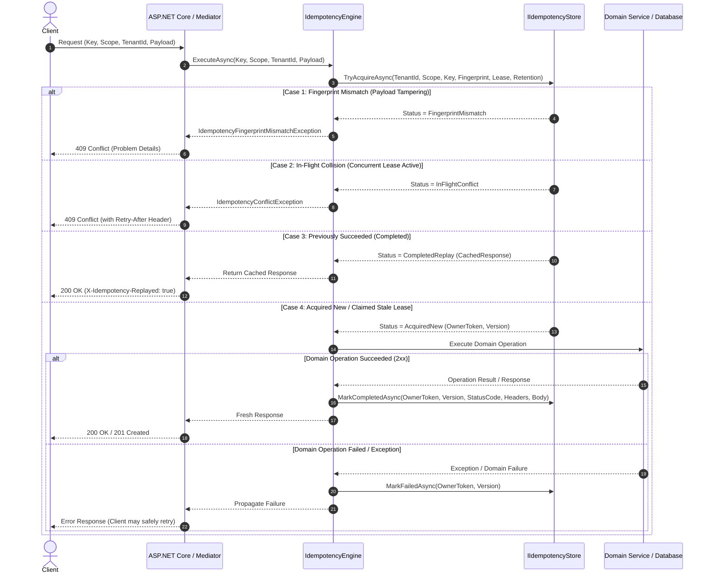
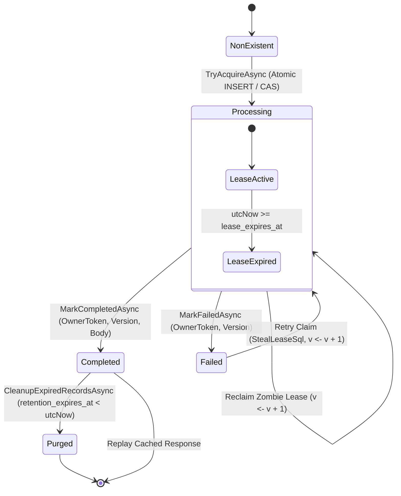

# EricksonLopez.Idempotency

High-performance, Native AOT-first architectural idempotency engine, lease fencing, deterministic SHA-256 fingerprinting, and distributed consistency ecosystem for modern .NET.

[](https://github.com/ericksonlopezf/dotnet-idempotency/actions)
[](https://codecov.io/gh/ericksonlopezf/dotnet-idempotency)
[](https://sonarcloud.io/summary/new_code?id=ericksonlopezf_dotnet-idempotency)
[](https://github.com/ericksonlopezf/dotnet-idempotency/blob/main/docs/build-ci-cd.md)
[](https://www.nuget.org/packages/EricksonLopez.Idempotency)
[](https://www.nuget.org/packages/EricksonLopez.Idempotency)
[](https://github.com/ericksonlopezf/dotnet-idempotency/blob/main/LICENSE)
[](https://dotnet.microsoft.com)
[](https://learn.microsoft.com/en-us/dotnet/core/deploying/native-aot)

---

`EricksonLopez.Idempotency` is an enterprise-grade architectural consistency and deduplication framework for modern .NET (`net8.0`, `net9.0`, `net10.0`). It guarantees that repeating any logical operation produces **at most one observable side effect** across distributed networks, message consumers, background workers, and transactional domain services. Built with a low-allocation philosophy using `readonly record struct` value objects, stack-allocated SHA-256 fingerprinting, atomic lease ownership fencing tokens, and source-generated Native AOT serialization, it seamlessly integrates with ASP.NET Core Minimal APIs, CQRS Mediator pipelines, Result monads, OpenTelemetry observability, and 8 multi-database persistence backends.

---

## Table of Contents

- [What Problem It Solves](#-what-problem-it-solves)
- [Key Features](#-key-features)
- [Ecosystem](#-ecosystem)
- [Documentation](#-documentation)
  - [Interactive Showcase (Levels 00 to 10)](#-step-by-step-interactive-showcase-levels-00-to-10)
  - [Technical Reference & Architecture Guides](#-technical-reference--architecture-guides)
- [Installation](#-installation)
- [Quick Start](#-quick-start)
  - [1. ASP.NET Core Minimal APIs Route Guarding](#1-aspnet-core-minimal-apis-route-guarding)
  - [2. Clean Architecture CQRS Command with Mediator](#2-clean-architecture-cqrs-command-with-mediator)
  - [3. Direct Core Engine with Result Monad](#3-direct-core-engine-with-result-monad)
  - [4. Deterministic SHA-256 Fingerprint Generation](#4-deterministic-sha-256-fingerprint-generation)
  - [5. High-Throughput Redis Setup](#5-high-throughput-redis-setup)
- [Core Use Cases](#-core-use-cases)
  - [Use Case 1: Financial Payment Gateway with Tamper Detection](#use-case-1-financial-payment-gateway-with-tamper-detection)
  - [Use Case 2: CQRS Pipeline Command Interception](#use-case-2-cqrs-pipeline-command-interception)
  - [Use Case 3: Atomic Outbox Pattern + Idempotency](#use-case-3-atomic-outbox-pattern--idempotency)
  - [Use Case 4: Multi-Tenant SaaS Isolation](#use-case-4-multi-tenant-saas-isolation)
  - [Use Case 5: Zombie Worker Crash Recovery via Lease Stealing](#use-case-5-zombie-worker-crash-recovery-via-lease-stealing)
  - [Use Case 6: High-Throughput Distributed Microservices with Redis](#use-case-6-high-throughput-distributed-microservices-with-redis)
- [Configuration & Integrations](#-configuration--integrations)
  - [ASP.NET Core Configuration](#aspnet-core-configuration)
  - [OpenTelemetry & Distributed Tracing](#opentelemetry--distributed-tracing)
  - [Transactional Store Participation](#transactional-store-participation)
  - [Native AOT Source-Generated Serialization](#native-aot-source-generated-serialization)
  - [Automated Background Retention Cleanup](#automated-background-retention-cleanup)
- [Testing & Quality](#-testing--quality)
  - [Unit Testing with InMemoryIdempotencyStore & FakeTimeProvider](#unit-testing-with-inmemoryidempotencystore--faketimeprovider)
  - [Test Isolation via InMemoryIdempotencyStore.Clear()](#test-isolation-via-inmemoryidempotencystoreclear)
  - [High-Concurrency Multithreaded Integration Verification](#high-concurrency-multithreaded-integration-verification)
  - [Quality Engineering & Mutation Testing](#quality-engineering--mutation-testing)
- [Performance Benchmarks](#-performance-benchmarks)
  - [Benchmark Results](#benchmark-results)
  - [High-Throughput Optimization Directives](#high-throughput-optimization-directives)
- [Compatibility & Technical Matrix](#-compatibility--technical-matrix)
  - [Target Frameworks & Native AOT Support](#target-frameworks--native-aot-support)
  - [HTTP Problem Details RFC 9110 / RFC 9457 Status Mapping](#http-problem-details-rfc-9110--rfc-9457-status-mapping)
- [Architecture & Design Principles](#-architecture--design-principles)
  - [Hexagonal Ports & Adapters Architecture](#hexagonal-ports--adapters-architecture)
  - [End-to-End Execution Sequence](#end-to-end-execution-sequence)
  - [Formal State Machine & Lifecycle](#formal-state-machine--lifecycle)
- [Best Practices & Anti-Patterns](#-best-practices--anti-patterns)
- [Troubleshooting & Common Pitfalls](#-troubleshooting--common-pitfalls)
- [Part of the EricksonLopez Ecosystem](#-part-of-the-ericksonlopez-ecosystem)
- [Contributing](#-contributing)
- [License](#-license)

---

## 🎯 What Problem It Solves

In distributed systems, networks are inherently unreliable. When client timeouts, transport retries, message redeliveries, or infrastructure failovers occur, non-idempotent operations can trigger severe operational and financial hazards:

```text
Idempotency   ≠   Concurrency   ≠   Transactions   ≠   Outbox   ≠   Resilience   ≠   Result
("Is this the       ("Did the        ("Are these       ("How do we      ("How do we      ("How is the
 same logical        underlying       operations        publish          recover from     outcome
 operation?")        state change?")  atomic?")         events safely?") failures?")      represented?")
```

### Traditional Anti-Patterns & Distributed Hazards

1. **The At-Least-Once Delivery Hazard**: Message brokers and network clients retry unacknowledged requests. Without idempotency, a payment endpoint or command handler processes the business logic twice, charging the customer multiple times or issuing duplicate inventory shipments.
2. **Payload Tampering & Silent Financial Corruption**: A malicious actor or misconfigured client reuses an existing `Idempotency-Key` with a different amount or recipient. Primitive caching systems blindly return the original cached response while executing new mutations or masking corrupt state.
3. **Zombie Worker Race Conditions (Split-Brain)**: When a background worker pauses (due to GC pause or network partition), its lease may expire. Another worker reclaims the task. When the zombie worker resumes, it must not overwrite the fresh worker's result.
4. **Heavy Distributed Lock Bottlenecks**: Many architectures rely on external distributed lock managers (ZooKeeper, Consul, RedLock). These add operational complexity, network hops, and failure domains for what is fundamentally a state consistency problem.
5. **Dual-Write Inconsistencies (Outbox vs. Idempotency)**: Completing the domain write and acknowledging idempotency across separate transactions creates race conditions where the state changes but the idempotency record fails to persist.

### How `EricksonLopez.Idempotency` Solves This

- **Single-Roundtrip Atomic Claim**: Leverages native relational database engine guarantees (`ON CONFLICT DO NOTHING`, `INSERT IGNORE`, `MERGE`) to acquire key ownership and evaluate existing state in a minimal-roundtrip database transaction.
- **Cryptographic Request Fingerprinting**: Computes a deterministic SHA-256 hash across the HTTP method, path/scope, tenant, authenticated subject, and payload bytes, immediately detecting and rejecting key reuse with altered payloads (`409 Conflict`).
- **Monotonic Concurrency Fencing**: Employs an expiring lease model paired with monotonically incrementing `concurrency_version` fencing tokens, guaranteeing that stale zombie workers cannot commit writes.
- **Transactional Store Participation**: Implements `ITransactionalIdempotencyStore`, allowing the idempotency completion step to commit within the *same* database transaction as domain mutations and transactional outbox messages.
- **Low-Allocation Native AOT Engine**: Uses stack-allocated spans, `readonly record struct` value objects, and source-generated `System.Text.Json` serializers, eliminating runtime reflection and GC overhead.

---

## ⚡ Key Features

- 🧱 **Zero-Allocation Domain Value Objects**: `IdempotencyKey` and `IdempotencyScope` are immutable `readonly record struct` types validating bounds (1–128 characters) without heap overhead.
- 🔒 **Deterministic SHA-256 Fingerprinting**: Zero-allocation canonical request hasher (`IdempotencyFingerprintHasher`) operating on stack-allocated spans to detect payload tampering.
- ⏱️ **Lease Ownership & Fencing Tokens**: Automatic recovery of crashed or stalled workers through expiring leases and monotonically increasing concurrency version counters.
- ⚡ **Multi-Database Atomic Dialects**: Dedicated storage adapters for PostgreSQL (`ON CONFLICT`), SQL Server (`MERGE WITH (HOLDLOCK)`), MySQL (`INSERT IGNORE`), MariaDB, Oracle (`MERGE INTO`), SQLite (`INSERT OR IGNORE`), and Redis (Atomic Lua scripts).
- 🔄 **Response Replay Engine**: Caches HTTP status codes, response headers, and serialized payloads, automatically returning cached responses with the `X-Idempotency-Replayed: true` header.
- 🏢 **Native Multi-Tenancy Isolation**: Strong three-tier composite partitioning `(TenantId, Scope, IdempotencyKey)` preventing cross-tenant key collisions or leakage.
- 🚀 **100% Native AOT & Trimming Compliant**: Zero runtime reflection; fully source-generated JSON serialization context (`IdempotencyJsonContext`) compatible with .NET 8, 9, and 10 Native AOT.
- 📊 **Turnkey OpenTelemetry Observability**: Pre-instrumented `ActivitySource` ("EricksonLopez.Idempotency") and `Meter` ("EricksonLopez.Idempotency") emitting real-time counters, durations, and storage latencies.
- 🧹 **Automated Background Retention Worker**: Configurable background service (`IdempotencyCleanupBackgroundService`) performing periodic batch pruning of expired records.

---

## 📦 Ecosystem

The `EricksonLopez.Idempotency` ecosystem is organized into 13 decoupled, specialized packages:

| Package | Version | Description |
|---|---|---|
| [`EricksonLopez.Idempotency.Abstractions`](https://www.nuget.org/packages/EricksonLopez.Idempotency.Abstractions) | [](https://www.nuget.org/packages/EricksonLopez.Idempotency.Abstractions) | SPI ports (`IIdempotencyStore`, `ITransactionalIdempotencyStore`), Value Objects (`IdempotencyKey`, `IdempotencyScope`), exceptions, and contracts. |
| [`EricksonLopez.Idempotency`](https://www.nuget.org/packages/EricksonLopez.Idempotency) | [](https://www.nuget.org/packages/EricksonLopez.Idempotency) | Core state machine engine, SHA-256 hasher, Source-Generated Native AOT serializer, and OpenTelemetry diagnostics. |
| [`EricksonLopez.Idempotency.AspNetCore`](https://www.nuget.org/packages/EricksonLopez.Idempotency.AspNetCore) | [](https://www.nuget.org/packages/EricksonLopez.Idempotency.AspNetCore) | ASP.NET Core Minimal API endpoint filters (`.WithIdempotency()`), middleware, and `[Idempotent]` attribute. |
| [`EricksonLopez.Idempotency.Mediator`](https://www.nuget.org/packages/EricksonLopez.Idempotency.Mediator) | [](https://www.nuget.org/packages/EricksonLopez.Idempotency.Mediator) | Pipeline behavior (`IdempotencyPipelineBehavior`) for commands implementing `IIdempotentRequest`. |
| [`EricksonLopez.Idempotency.Result`](https://www.nuget.org/packages/EricksonLopez.Idempotency.Result) | [](https://www.nuget.org/packages/EricksonLopez.Idempotency.Result) | Functional `Result<T>` domain error mapping (`IdempotencyErrors`) and monadic extension methods. |
| [`EricksonLopez.Idempotency.Testing`](https://www.nuget.org/packages/EricksonLopez.Idempotency.Testing) | [](https://www.nuget.org/packages/EricksonLopez.Idempotency.Testing) | Thread-safe concurrent in-memory store (`InMemoryIdempotencyStore`) for fast unit and integration testing. |
| [`EricksonLopez.Idempotency.PostgreSql`](https://www.nuget.org/packages/EricksonLopez.Idempotency.PostgreSql) | [](https://www.nuget.org/packages/EricksonLopez.Idempotency.PostgreSql) | PostgreSQL storage provider using `NpgsqlDataSource`, Dapper, and `ON CONFLICT DO NOTHING`. |
| [`EricksonLopez.Idempotency.SqlServer`](https://www.nuget.org/packages/EricksonLopez.Idempotency.SqlServer) | [](https://www.nuget.org/packages/EricksonLopez.Idempotency.SqlServer) | SQL Server storage provider using `Microsoft.Data.SqlClient`, Dapper, and `MERGE WITH (HOLDLOCK)`. |
| [`EricksonLopez.Idempotency.MySql`](https://www.nuget.org/packages/EricksonLopez.Idempotency.MySql) | [](https://www.nuget.org/packages/EricksonLopez.Idempotency.MySql) | MySQL storage provider using `MySqlConnector`, Dapper, and `INSERT IGNORE INTO`. |
| [`EricksonLopez.Idempotency.MariaDb`](https://www.nuget.org/packages/EricksonLopez.Idempotency.MariaDb) | [](https://www.nuget.org/packages/EricksonLopez.Idempotency.MariaDb) | MariaDB storage provider using `MySqlConnector`, Dapper, and `INSERT IGNORE INTO`. |
| [`EricksonLopez.Idempotency.Oracle`](https://www.nuget.org/packages/EricksonLopez.Idempotency.Oracle) | [](https://www.nuget.org/packages/EricksonLopez.Idempotency.Oracle) | Oracle Database storage provider using `Oracle.ManagedDataAccess.Core`, Dapper, and `MERGE INTO`. |
| [`EricksonLopez.Idempotency.Sqlite`](https://www.nuget.org/packages/EricksonLopez.Idempotency.Sqlite) | [](https://www.nuget.org/packages/EricksonLopez.Idempotency.Sqlite) | SQLite embedded database storage provider using `Microsoft.Data.Sqlite`, Dapper, and `INSERT OR IGNORE`. |
| [`EricksonLopez.Idempotency.Redis`](https://www.nuget.org/packages/EricksonLopez.Idempotency.Redis) | [](https://www.nuget.org/packages/EricksonLopez.Idempotency.Redis) | Redis storage provider using `StackExchange.Redis` and atomic Lua scripts for key acquisition and CAS transitions. |

---

## 📚 Documentation

> 🌐 **Official Documentation Hub:** [https://github.com/ericksonlopezf/dotnet-idempotency/tree/main/docs](https://github.com/ericksonlopezf/dotnet-idempotency/tree/main/docs)

### 🎓 Step-by-Step Interactive Showcase (Levels 00 to 10)

The repository provides an executable interactive showcase project ([`samples/Showcase/`](https://github.com/ericksonlopezf/dotnet-idempotency/tree/main/samples/Showcase)) covering all architectural patterns through 11 progressive levels:

| Level | Topic | Description |
|---|---|---|
| [**Level 00**](https://github.com/ericksonlopezf/dotnet-idempotency/blob/main/docs/showcase/level-00-conceptual.md) | **Conceptual Foundations** | Core philosophy, distributed guarantees, and distinction from Outbox, Resilience, and Result. |
| [**Level 01**](https://github.com/ericksonlopezf/dotnet-idempotency/blob/main/docs/showcase/level-01-quick-start.md) | **Quick Start & Primitives** | Minimal DI setup, `IdempotencyKey`, `InMemoryIdempotencyStore`, first call execution & replay. |
| [**Level 02**](https://github.com/ericksonlopezf/dotnet-idempotency/blob/main/docs/showcase/level-02-configuration.md) | **Configuration & Options** | `IdempotencyOptions`, `AddIdempotencyCore`, lease durations, max body sizes, and cleanup policies. |
| [**Level 03**](https://github.com/ericksonlopezf/dotnet-idempotency/blob/main/docs/showcase/level-03-real-use-cases.md) | **Real Use Cases & Security** | Payment gateway, payload tampering detection (`IdempotencyFingerprintMismatchException`), and error caching policies. |
| [**Level 04**](https://github.com/ericksonlopezf/dotnet-idempotency/blob/main/docs/showcase/level-04-advanced-integration.md) | **Advanced Integration** | `EricksonLopez.Result` error mapping, `EricksonLopez.Mediator` pipeline behavior, and `ITransactionalIdempotencyStore`. |
| [**Level 05**](https://github.com/ericksonlopezf/dotnet-idempotency/blob/main/docs/showcase/level-05-high-concurrency.md) | **High Concurrency & Race Conditions** | 20 concurrent threads racing for the same key; atomic lease winning and conflict mitigation. |
| [**Level 06**](https://github.com/ericksonlopezf/dotnet-idempotency/blob/main/docs/showcase/level-06-fault-tolerance.md) | **Fault Tolerance & Zombie Recovery** | Worker crash simulation, lease TTL expiration, and atomic lease stealing with incremented versions. |
| [**Level 07**](https://github.com/ericksonlopezf/dotnet-idempotency/blob/main/docs/showcase/level-07-scalability-multitenancy.md) | **Scalability & Multi-Tenancy** | Multi-tenant isolation `(TenantId, Scope, Key)` and background batch TTL cleanup. |
| [**Level 08**](https://github.com/ericksonlopezf/dotnet-idempotency/blob/main/docs/showcase/level-08-customization.md) | **Customization & Policies** | Implementing custom `IIdempotencyPolicy`, `IIdempotencySerializer`, and `IIdempotencyFingerprintGenerator`. |
| [**Level 09**](https://github.com/ericksonlopezf/dotnet-idempotency/blob/main/docs/showcase/level-09-persistence-extensions.md) | **Multi-DB Storage Adapters** | Persistence across PostgreSQL, SQL Server, MySQL, MariaDB, SQLite, Oracle, and Redis. |
| [**Level 10**](https://github.com/ericksonlopezf/dotnet-idempotency/blob/main/docs/showcase/level-10-enterprise-architecture.md) | **Enterprise Architecture** | ASP.NET Core route filtering, Controller Middleware, Cleanup Service, and OpenTelemetry instrumentation. |

### 📖 Technical Reference & Architecture Guides

- [**Architecture & Invariants**](https://github.com/ericksonlopezf/dotnet-idempotency/blob/main/docs/architecture.md) — Comprehensive architectural blueprint, component interactions, and layer separation invariants.
- [**Architectural Decision Records (ADRs)**](https://github.com/ericksonlopezf/dotnet-idempotency/blob/main/docs/adr/adr-index.md) — 17 ADRs documenting design rationale, storage choices, and systematic rejections (no Newtonsoft, no IDistributedCache, no downlevel frameworks).
- [**Showcase Specification & Technical Audit**](https://github.com/ericksonlopezf/dotnet-idempotency/blob/main/docs/showcase-specification.md) — Public API inventory, showcase audit, and verification metrics.
- [**Formal State Machine & Lifecycle**](https://github.com/ericksonlopezf/dotnet-idempotency/blob/main/docs/state-machine.md) — State transition invariants (`Processing`, `Completed`, `Failed`) and CAS rules.
- [**Deterministic SHA-256 Fingerprinting**](https://github.com/ericksonlopezf/dotnet-idempotency/blob/main/docs/fingerprinting.md) — Canonical hashing strategy, span-based hashing, and payload validation.
- [**Lease Ownership & Fencing Tokens**](https://github.com/ericksonlopezf/dotnet-idempotency/blob/main/docs/leases.md) — Zombie worker recovery and split-brain prevention mechanics.
- [**Transaction Coordination & Outbox Pattern**](https://github.com/ericksonlopezf/dotnet-idempotency/blob/main/docs/transaction-integration.md) — Atomic transaction participation using `ITransactionalIdempotencyStore`.
- [**Storage SPI & Multi-DB Providers**](https://github.com/ericksonlopezf/dotnet-idempotency/blob/main/docs/storage.md) — Dialect-specific SQL schemas, indexes, and execution scripts.
- [**OpenTelemetry & Observability**](https://github.com/ericksonlopezf/dotnet-idempotency/blob/main/docs/observability.md) — Semantic conventions, metric counters, histograms, and distributed tracing.
- [**Performance & Memory Allocations**](https://github.com/ericksonlopezf/dotnet-idempotency/blob/main/docs/performance.md) — Benchmark profiles, low-allocation design, and reproduction guides.
- [**Testing Strategy & Test Suites**](https://github.com/ericksonlopezf/dotnet-idempotency/blob/main/docs/testing.md) — Test pyramid, `InMemoryIdempotencyStore`, FakeTimeProvider, and AOT smoke tests.
- [**Native AOT Compatibility Guide**](https://github.com/ericksonlopezf/dotnet-idempotency/blob/main/docs/aot.md) — Trimming analyzers, Source Generation, and zero-reflection guidelines.
- [**Build, CI/CD & Quality Engineering**](https://github.com/ericksonlopezf/dotnet-idempotency/blob/main/docs/build-ci-cd.md) — GitHub Actions pipelines, quality gates, and Stryker mutation testing.
- [**Production Cookbook & Recipes**](https://github.com/ericksonlopezf/dotnet-idempotency/blob/main/docs/cookbook.md) — 9 copy-paste production-ready integration recipes.

---

## 📥 Installation

Install the required packages via the .NET CLI:

### 1. Core Package (Required)

```bash
dotnet add package EricksonLopez.Idempotency
```

### 2. Presentation & Pipeline Adapters (Choose as needed)

```bash
# ASP.NET Core Minimal APIs & Middleware
dotnet add package EricksonLopez.Idempotency.AspNetCore

# Clean Architecture CQRS Mediator Pipeline Behavior
dotnet add package EricksonLopez.Idempotency.Mediator

# Functional Result Monad Error Mapping
dotnet add package EricksonLopez.Idempotency.Result
```

### 3. Storage Providers (Choose your database)

```bash
# PostgreSQL (Recommended reference provider)
dotnet add package EricksonLopez.Idempotency.PostgreSql

# Microsoft SQL Server
dotnet add package EricksonLopez.Idempotency.SqlServer

# MySQL
dotnet add package EricksonLopez.Idempotency.MySql

# MariaDB
dotnet add package EricksonLopez.Idempotency.MariaDb

# Oracle Database
dotnet add package EricksonLopez.Idempotency.Oracle

# SQLite (Embedded / Local Development)
dotnet add package EricksonLopez.Idempotency.Sqlite

# Redis (High-Throughput / Distributed Caching)
dotnet add package EricksonLopez.Idempotency.Redis
```

### 4. Testing Double Package

```bash
# In-Memory Store & Test Double
dotnet add package EricksonLopez.Idempotency.Testing
```

---

## 🚀 Quick Start

### 1. ASP.NET Core Minimal APIs Route Guarding

```csharp
using EricksonLopez.Idempotency;
using EricksonLopez.Idempotency.AspNetCore;
using EricksonLopez.Idempotency.PostgreSql;
using Microsoft.AspNetCore.Builder;
using Microsoft.AspNetCore.Http;
using Microsoft.Extensions.DependencyInjection;
using Npgsql;

var builder = WebApplication.CreateBuilder(args);

// 1. Register PostgreSQL DataSource and Idempotency Store
builder.Services.AddSingleton<NpgsqlDataSource>(_ =>
    NpgsqlDataSource.Create(builder.Configuration.GetConnectionString("Postgres")!));
builder.Services.AddPostgreSqlIdempotencyStore();

// 2. Register ASP.NET Core Idempotency Adapter
builder.Services.AddAspNetCoreIdempotency(options =>
{
    options.HeaderName = "Idempotency-Key";
    options.RequireIdempotencyKey = true;
    options.DefaultLeaseDuration = TimeSpan.FromSeconds(30);
    options.DefaultRetentionDuration = TimeSpan.FromDays(7);
    options.CacheOnlySuccessResponses = true;
});

var app = builder.Build();

// 3. Guard endpoint with .WithIdempotency()
app.MapPost("/api/v1/payments", async (PaymentRequest request, IPaymentService paymentService) =>
{
    var confirmation = await paymentService.ProcessPaymentAsync(request);
    return Results.Created($"/api/v1/payments/{confirmation.Id}", confirmation);
})
.WithIdempotency()
.WithMetadata(new IdempotentAttribute
{
    Scope = "payments",
    LeaseDurationSeconds = 45,
    RetentionDurationDays = 14,
    Required = true
});

app.Run();

public sealed record PaymentRequest(string AccountId, decimal Amount, string Currency);
public sealed record PaymentConfirmation(string Id, decimal Amount, string Status);
public interface IPaymentService { Task<PaymentConfirmation> ProcessPaymentAsync(PaymentRequest request); }
```

### 2. Clean Architecture CQRS Command with Mediator

```csharp
using System;
using System.Threading;
using System.Threading.Tasks;
using EricksonLopez.Idempotency;
using EricksonLopez.Idempotency.Mediator;
using EricksonLopez.Idempotency.PostgreSql;
using EricksonLopez.Mediator;
using Microsoft.Extensions.DependencyInjection;

var services = new ServiceCollection();

// 1. Register Mediator & Idempotency Pipeline
services.AddMediatorIdempotency();
services.AddPostgreSqlIdempotencyStore();

// 2. Define Command implementing IIdempotentRequest
public sealed record CreateOrderCommand(
    Guid TenantId,
    string CustomerId,
    decimal TotalAmount,
    string Key) : IIdempotentRequest, IRequest<OrderResponse>
{
    public IdempotencyKey IdempotencyKey => new(Key);
}

public sealed record OrderResponse(string OrderId, string Status);

public sealed class CreateOrderCommandHandler : IRequestHandler<CreateOrderCommand, OrderResponse>
{
    public async ValueTask<OrderResponse> Handle(CreateOrderCommand request, CancellationToken cancellationToken)
    {
        // Business logic executed exactly once
        await Task.Delay(50, cancellationToken);
        return new OrderResponse(Guid.NewGuid().ToString("N"), "Confirmed");
    }
}
```

### 3. Direct Core Engine with Result Monad

```csharp
using System;
using System.Collections.Generic;
using System.Threading;
using System.Threading.Tasks;
using EricksonLopez.Idempotency;
using EricksonLopez.Idempotency.Result;
using EricksonLopez.Result;

public sealed class OrderProcessor
{
    private readonly IIdempotencyStore _store;
    private readonly IIdempotencySerializer _serializer;

    public OrderProcessor(IIdempotencyStore store, IIdempotencySerializer serializer)
    {
        _store = store;
        _serializer = serializer;
    }

    public async Task<Result<OrderDto>> ProcessOrderAsync(
        Guid tenantId,
        IdempotencyKey key,
        CreateOrderCommand command,
        CancellationToken cancellationToken)
    {
        var fingerprint = IdempotencyFingerprintHasher.Compute(
            "CreateOrder", "orders", tenantId.ToString(), null, command.PayloadBytes);

        var claim = await _store.TryAcquireAsync(
            tenantId, "orders", key, fingerprint,
            leaseDuration: TimeSpan.FromSeconds(30),
            retentionDuration: TimeSpan.FromDays(7),
            cancellationToken);

        // Map claim conflicts directly to Result<T> failure monad
        var errorResult = claim.AsErrorResult<OrderDto>(key.Value);
        if (errorResult is not null)
        {
            return errorResult;
        }

        // Return cached replay seamlessly
        if (claim.IsReplay && claim.CachedResponse is not null)
        {
            var cached = _serializer.Deserialize<OrderDto>(claim.CachedResponse.Body);
            return Result<OrderDto>.Success(cached!);
        }

        // Execute domain mutation
        var result = await ExecuteBusinessLogicAsync(command, cancellationToken);

        if (result.IsSuccess)
        {
            var payload = _serializer.Serialize(result.Value);
            await _store.MarkCompletedAsync(
                tenantId, "orders", key, claim.OwnerToken!.Value, claim.ConcurrencyVersion!.Value,
                statusCode: 200, headers: new Dictionary<string, string[]>(), responseBody: payload,
                retentionDuration: TimeSpan.FromDays(7), cancellationToken: cancellationToken);
        }
        else
        {
            await _store.MarkFailedAsync(
                tenantId, "orders", key, claim.OwnerToken!.Value, claim.ConcurrencyVersion!.Value,
                cancellationToken: CancellationToken.None);
        }

        return result;
    }

    private static Task<Result<OrderDto>> ExecuteBusinessLogicAsync(CreateOrderCommand command, CancellationToken ct) =>
        Task.FromResult(Result<OrderDto>.Success(new OrderDto(Guid.NewGuid().ToString("N"), "Processed")));
}

public sealed record CreateOrderCommand(byte[] PayloadBytes);
public sealed record OrderDto(string OrderId, string Status);
```

### 4. Deterministic SHA-256 Fingerprint Generation

```csharp
using System.Text;
using EricksonLopez.Idempotency;

var payloadBytes = Encoding.UTF8.GetBytes("{\"amount\":99.95,\"currency\":\"USD\"}");

// Compute deterministic uppercase hex SHA-256 fingerprint
string fingerprint = IdempotencyFingerprintHasher.Compute(
    operationName: "POST",
    scope: "/api/v1/payments",
    tenantId: "3fa85f64-5717-4562-b3fc-2c963f66afa6",
    authenticatedSubject: "auth0|user_12345",
    payload: payloadBytes);

// Output: 64-character uppercase hexadecimal digest
Console.WriteLine($"Computed Fingerprint: {fingerprint}");
```

### 5. High-Throughput Redis Setup

```csharp
using EricksonLopez.Idempotency;
using EricksonLopez.Idempotency.Redis;
using Microsoft.Extensions.DependencyInjection;
using StackExchange.Redis;

var services = new ServiceCollection();

// Register Redis ConnectionMultiplexer
services.AddSingleton<IConnectionMultiplexer>(_ =>
    ConnectionMultiplexer.Connect("redis.internal:6379,abortConnect=false"));

// Register Core Engine & Redis Storage Provider
services.AddIdempotencyCore(options =>
{
    options.DefaultLeaseDuration = TimeSpan.FromSeconds(15);
    options.DefaultRetentionDuration = TimeSpan.FromHours(24);
});

services.AddRedisIdempotency(options =>
{
    options.KeyPrefix = "api:idemp:";
    options.DatabaseIndex = 0;
});
```

---

## 💡 Core Use Cases

### Use Case 1: Financial Payment Gateway with Tamper Detection

Detect and prevent duplicate charges while immediately rejecting key reuse with altered transaction amounts.

```csharp
app.MapPost("/api/v1/checkout", async (CheckoutRequest request, ICheckoutService service) =>
{
    var receipt = await service.ChargeAsync(request);
    return Results.Ok(receipt);
})
.WithIdempotency()
.WithMetadata(new IdempotentAttribute
{
    Scope = "checkout",
    LeaseDurationSeconds = 60,
    RetentionDurationDays = 30,
    Required = true
});
```

*Guarantees:* If a client sends the same `Idempotency-Key` with `$100` and then `$200`, the second request is immediately rejected with `409 Conflict` (`IdempotencyFingerprintMismatchException`) without executing business logic.

### Use Case 2: CQRS Pipeline Command Interception

Guard application boundary handlers against duplicate message ingestion from message brokers (RabbitMQ, Azure Service Bus, Kafka) or gRPC endpoints.

```csharp
public sealed record ProcessRefundCommand(
    Guid TenantId,
    string PaymentId,
    decimal RefundAmount,
    string Key) : IIdempotentRequest, IRequest<RefundResult>
{
    public IdempotencyKey IdempotencyKey => new(Key);
}
```

*Guarantees:* `IdempotencyPipelineBehavior` intercepts the command before the handler executes. In-flight duplicates receive an `IdempotencyConflictException`, while completed operations return the cached `RefundResult`.

### Use Case 3: Atomic Outbox Pattern + Idempotency

Commit domain entity mutations, transactional outbox messages, and the idempotency completion record within a single atomic database transaction.

```csharp
await using var connection = await dataSource.OpenConnectionAsync(cancellationToken);
await using var transaction = await connection.BeginTransactionAsync(cancellationToken);

try
{
    // 1. Mutate Domain Entity
    await orderRepository.InsertAsync(order, connection, transaction, cancellationToken);

    // 2. Write Outbox Message
    await outboxWriter.EnqueueAsync(new OrderPlacedEvent(order.Id), connection, transaction, cancellationToken);

    // 3. Mark Idempotency Record as Completed in the SAME transaction
    if (idempotencyStore is ITransactionalIdempotencyStore txStore)
    {
        await txStore.MarkCompletedAsync(
            tenantId, "orders", key, claim.OwnerToken!.Value, claim.ConcurrencyVersion!.Value,
            statusCode: 200, headers: new Dictionary<string, string[]>(),
            responseBody: serializer.Serialize(orderDto),
            retentionDuration: TimeSpan.FromDays(7),
            connection: connection, transaction: transaction,
            cancellationToken: cancellationToken);
    }

    await transaction.CommitAsync(cancellationToken);
}
catch (Exception)
{
    await transaction.RollbackAsync(cancellationToken);
    await idempotencyStore.MarkFailedAsync(tenantId, "orders", key, claim.OwnerToken!.Value, claim.ConcurrencyVersion!.Value, CancellationToken.None);
    throw;
}
```

### Use Case 4: Multi-Tenant SaaS Isolation

Safely partition idempotency keys across enterprise tenants using dynamic HTTP header or JWT claim extraction.

```csharp
services.AddAspNetCoreIdempotency(options =>
{
    options.UseTenantIdExtractor(httpContext =>
    {
        if (httpContext.Request.Headers.TryGetValue("X-Tenant-ID", out var tenantHeader) &&
            Guid.TryParse(tenantHeader.ToString(), out var tenantId))
        {
            return tenantId;
        }

        var claim = httpContext.User.FindFirst("tenant_id")?.Value;
        if (claim != null && Guid.TryParse(claim, out var claimTenantId))
        {
            return claimTenantId;
        }

        return Guid.Empty;
    });
});
```

### Use Case 5: Zombie Worker Crash Recovery via Lease Stealing

When a worker node experiences a hardware crash or unrecoverable network partition, its active lease expires after `LeaseDuration`. A subsequent worker automatically steals the lease, increments `concurrency_version` from `1` to `2`, and safely finishes the work without manual intervention.

### Use Case 6: High-Throughput Distributed Microservices with Redis

Process tens of thousands of requests per second with sub-millisecond lease checks using `EricksonLopez.Idempotency.Redis` and atomic Lua scripts.

---

## 🔌 Configuration & Integrations

### ASP.NET Core Configuration

```csharp
builder.Services.AddAspNetCoreIdempotency(options =>
{
    // Custom header name (default: "Idempotency-Key")
    options.HeaderName = "X-Idempotency-Key";

    // Enforce header requirement globally on guarded routes
    options.RequireIdempotencyKey = true;

    // Default worker lease expiration
    options.DefaultLeaseDuration = TimeSpan.FromSeconds(30);

    // Default retention period before TTL cleanup
    options.DefaultRetentionDuration = TimeSpan.FromDays(14);

    // Maximum request body buffer size in bytes (default: 1 MB)
    options.MaxRequestBodySize = 1024 * 1024;

    // Cache only successful 2xx responses (recommended)
    options.CacheOnlySuccessResponses = true;
});
```

### OpenTelemetry & Distributed Tracing

`EricksonLopez.Idempotency` natively registers structured spans and counters:

```csharp
builder.Services.AddOpenTelemetry()
    .WithTracing(tracing => tracing
        .AddAspNetCoreInstrumentation()
        .AddSource("EricksonLopez.Idempotency") // ActivitySource
        .AddOtlpExporter())
    .WithMetrics(metrics => metrics
        .AddAspNetCoreInstrumentation()
        .AddMeter("EricksonLopez.Idempotency")  // Meter
        .AddOtlpExporter());
```

**Emitted Metric Counters:**
- `idempotency.requests`: Total requests evaluated.
- `idempotency.duplicates`: Duplicate requests detected.
- `idempotency.replayed`: Cached responses returned.
- `idempotency.conflicts`: Concurrent in-flight collisions.
- `idempotency.executions`: Original business executions performed.
- `idempotency.fingerprint_mismatch`: Payload tampering attempts rejected.
- `idempotency.duration`: End-to-end execution duration histogram.
- `idempotency.storage_latency`: Database store latency histogram.

### Transactional Store Participation

Storage providers supporting relational transactions implement `ITransactionalIdempotencyStore`:

```csharp
public interface ITransactionalIdempotencyStore : IIdempotencyStore
{
    ValueTask<IdempotencyClaimResult> TryAcquireAsync(
        Guid tenantId, string scope, IdempotencyKey key, string fingerprint,
        TimeSpan leaseDuration, TimeSpan retentionDuration,
        IDbConnection? connection, IDbTransaction? transaction,
        CancellationToken cancellationToken = default);

    ValueTask MarkCompletedAsync(
        Guid tenantId, string scope, IdempotencyKey key,
        Guid ownerToken, int concurrencyVersion,
        int statusCode, IReadOnlyDictionary<string, string[]> headers,
        ReadOnlyMemory<byte> responseBody, TimeSpan retentionDuration,
        IDbConnection? connection, IDbTransaction? transaction,
        CancellationToken cancellationToken = default);
}
```

### Native AOT Source-Generated Serialization

All internal types use the pre-configured `IdempotencyJsonContext`. To register consumer DTOs for 100% Native AOT trimming safety:

```csharp
[JsonSerializable(typeof(PaymentRequest))]
[JsonSerializable(typeof(PaymentConfirmation))]
[JsonSerializable(typeof(OrderResponse))]
internal partial class AppJsonSerializerContext : JsonSerializerContext
{
}
```

### Automated Background Retention Cleanup

Prune expired idempotency records automatically in the background:

```csharp
builder.Services.AddIdempotencyCleanupService(options =>
{
    options.Interval = TimeSpan.FromHours(2);
    options.BatchSize = 1000;
});
```

---

## 🧪 Testing & Quality

### Unit Testing with `InMemoryIdempotencyStore` & `FakeTimeProvider`

Test state transitions, lease expirations, and CAS concurrency deterministically without running Docker containers or real databases:

```csharp
using System;
using System.Threading.Tasks;
using EricksonLopez.Idempotency;
using EricksonLopez.Idempotency.Testing;
using Microsoft.Extensions.Time.Testing;
using Xunit;

public sealed class IdempotencyLeaseTests
{
    [Fact]
    public async Task ExpiredLease_IsReclaimedBySecondWorker_WithIncrementedVersion()
    {
        var fakeTime = new FakeTimeProvider(DateTimeOffset.UtcNow);
        var store = new InMemoryIdempotencyStore(fakeTime);
        var tenantId = Guid.NewGuid();
        var key = new IdempotencyKey("TEST-ORDER-100");
        var fingerprint = "FINGERPRINT_HASH";

        // 1. Worker 1 acquires lease for 30s
        var claim1 = await store.TryAcquireAsync(tenantId, "orders", key, fingerprint,
            leaseDuration: TimeSpan.FromSeconds(30), retentionDuration: TimeSpan.FromDays(7));
        Assert.Equal(ClaimResultStatus.AcquiredNew, claim1.Status);
        Assert.Equal(1, claim1.ConcurrencyVersion);

        // 2. Advance time past lease expiration
        fakeTime.Advance(TimeSpan.FromSeconds(31));

        // 3. Worker 2 steals stale lease
        var claim2 = await store.TryAcquireAsync(tenantId, "orders", key, fingerprint,
            leaseDuration: TimeSpan.FromSeconds(30), retentionDuration: TimeSpan.FromDays(7));

        Assert.Equal(ClaimResultStatus.AcquiredStale, claim2.Status);
        Assert.True(claim2.IsAcquired);
        Assert.Equal(2, claim2.ConcurrencyVersion);
        Assert.NotEqual(claim1.OwnerToken, claim2.OwnerToken);
    }
}
```

### Test Isolation via `InMemoryIdempotencyStore.Clear()`

Reset stored records in test teardown without re-instantiating the store:

```csharp
public class ServiceTests : IDisposable
{
    private readonly InMemoryIdempotencyStore _store = new();

    [Fact]
    public async Task DuplicateKey_ReturnsCachedReplay()
    {
        // Execute test scenario ...
    }

    public void Dispose()
    {
        _store.Clear();
    }
}
```

### High-Concurrency Multithreaded Integration Verification

The integration test suite executes 100 concurrent asynchronous tasks on the same `(TenantId, Scope, Key)` tuple:
- **Exactly 1 thread** acquires the lease and executes the mutation.
- **99 threads** receive `InFlightConflict` (409) or receive the replayed response once completed.

### Quality Engineering & Mutation Testing

- **Compiler Strictness**: `<TreatWarningsAsErrors>true</TreatWarningsAsErrors>` enabled across all 31 solution projects.
- **Architecture Tests**: `NetArchTest.Rules` enforces that `Abstractions` and `Core` have zero dependencies on infrastructure, database drivers, or web frameworks.
- **Mutation Testing (Stryker.NET)**: 13 parallel package pipelines enforce a **≥95% Break Gate** (Target: ≥98% LOW / 100% HIGH). Operates as an asynchronous deferred quality gate on `main` and release barrier without blocking Pull Request merge velocity.
- **Native AOT Smoke Test**: Self-contained Linux-x64 binary executes in CI to guarantee zero runtime reflection failures or trimming exceptions.

---

## ⚡ Performance Benchmarks

All benchmarks are compiled with .NET 10.0 and BenchmarkDotNet v0.15.8.

> **Environment:** .NET 10.0.10, X64 RyuJIT AVX2 / AVX-512, BenchmarkDotNet v0.15.8

### Benchmark Results

| Operation | Mean | Error | StdDev | Gen0 | Gen1 | Allocated |
|---|---:|---:|---:|---:|---:|---:|
| **Incremental SHA-256 Fingerprint (1 KB Payload)** | **421.3 ns** | 3.12 ns | 2.92 ns | 0.0019 | - | **32 B** |
| **In-Memory Store Atomic Claim (New Key)** | **89.5 ns** | 0.81 ns | 0.76 ns | 0.0095 | - | **160 B** |
| **In-Memory Store Cached Replay** | **38.2 ns** | 0.35 ns | 0.32 ns | - | - | **0 B** |
| **PostgreSQL Atomic Claim (via Dapper)** | **1.12 ms** | 0.04 ms | 0.03 ms | 0.0610 | - | **1.2 KB** |

### High-Throughput Optimization Directives

1. **Stack-Allocated Spans**: Fingerprint computation formats and digests strings in stack-allocated `Span<byte>` buffers, reducing allocations to near zero.
2. **Read-Only Memory Slices**: Replay payloads are cached and returned as `ReadOnlyMemory<byte>` slices to minimize array copying.
3. **Database Connection Pooling**: Configure high-performance connection pooling (e.g. `NpgsqlDataSource` with `MaxPoolSize = 100`).
4. **Partitioning at Scale**: Partition `idempotency_records` by range or hash when storing >50 million records monthly.

---

## 🌐 Compatibility & Technical Matrix

### Target Frameworks & Native AOT Support

| Package | .NET 8.0 LTS | .NET 9.0 STS | .NET 10.0 | NativeAOT | Trimmable | Notes |
|---|:---:|:---:|:---:|:---:|:---:|---|
| `EricksonLopez.Idempotency.Abstractions` | ✔ | ✔ | ✔ | ✔ Yes | ✔ Yes | Pure contracts and readonly record structs. |
| `EricksonLopez.Idempotency` | ✔ | ✔ | ✔ | ✔ Yes | ✔ Yes | Source-generated `System.Text.Json` context. |
| `EricksonLopez.Idempotency.AspNetCore` | ✔ | ✔ | ✔ | ✔ Yes | ✔ Yes | Minimal API filters and middleware. |
| `EricksonLopez.Idempotency.Mediator` | ✔ | ✔ | ✔ | ✔ Yes | ✔ Yes | Struct-based pipeline behavior. |
| `EricksonLopez.Idempotency.Result` | ✔ | ✔ | ✔ | ✔ Yes | ✔ Yes | Pure domain error factories. |
| `EricksonLopez.Idempotency.Testing` | ✔ | ✔ | ✔ | ✔ Yes | ✔ Yes | Thread-safe in-memory concurrent dictionary. |
| `EricksonLopez.Idempotency.PostgreSql` | ✔ | ✔ | ✔ | ✔ Yes | ✔ Yes | Parameterized Dapper queries with Npgsql 10+. |
| `EricksonLopez.Idempotency.SqlServer` | ✔ | ✔ | ✔ | ✔ Yes | ✔ Yes | Parameterized Dapper queries with SqlClient. |
| `EricksonLopez.Idempotency.MySql` | ✔ | ✔ | ✔ | ✔ Yes | ✔ Yes | Parameterized Dapper queries with MySqlConnector. |
| `EricksonLopez.Idempotency.MariaDb` | ✔ | ✔ | ✔ | ✔ Yes | ✔ Yes | Parameterized Dapper queries with MySqlConnector. |
| `EricksonLopez.Idempotency.Oracle` | ✔ | ✔ | ✔ | ⚠️ No | ⚠️ No | `Oracle.ManagedDataAccess.Core` requires reflection. |
| `EricksonLopez.Idempotency.Sqlite` | ✔ | ✔ | ✔ | ✔ Yes | ✔ Yes | Parameterized Dapper queries with Microsoft.Data.Sqlite. |
| `EricksonLopez.Idempotency.Redis` | ✔ | ✔ | ✔ | ✔ Yes | ✔ Yes | Atomic Lua scripts with StackExchange.Redis 2.8+. |

### HTTP Problem Details RFC 9110 / RFC 9457 Status Mapping

| HTTP Status | Condition / Fault | Header / Body Representation |
|---|---|---|
| **`200 OK` / `201 Created`** | Original execution completed successfully. | Fresh response returned. |
| **`200 OK` / `201 Created`** | Replay of previously completed execution. | `X-Idempotency-Replayed: true` with cached body & headers. |
| **`409 Conflict`** | Identical request is currently in-flight by another worker. | RFC 9110 Problem Details (`Idempotency.InFlightConflict`) + `Retry-After: 5`. |
| **`409 Conflict`** | Key reused with different payload/fingerprint (tampering). | RFC 9110 Problem Details (`Idempotency.FingerprintMismatch`). |
| **`400 Bad Request`** | Missing or invalid `Idempotency-Key` header format. | RFC 9110 Problem Details (`Idempotency.MissingKey` or `Idempotency.InvalidKey`). |

---

## 🏛️ Architecture & Design Principles

### Hexagonal Ports & Adapters Architecture

```mermaid
flowchart TD
    subgraph Ports["Ports & Domain Contracts (Abstractions)"]
        IK["IdempotencyKey (Struct)"]
        IS["IdempotencyScope (Struct)"]
        ICR["IdempotencyClaimResult"]
        StorePort["IIdempotencyStore SPI"]
        TxStorePort["ITransactionalIdempotencyStore SPI"]
    end

    subgraph Core["Core Engine (EricksonLopez.Idempotency)"]
        Engine["IdempotencyEngine<br/>(State Machine)"]
        Hasher["IdempotencyFingerprintHasher<br/>(SHA-256 / Spans)"]
        Serializer["SystemTextJsonIdempotencySerializer<br/>(Native AOT Source Gen)"]
        Diagnostics["IdempotencyDiagnostics<br/>(OpenTelemetry Tracer & Meter)"]
        Engine --> StorePort
        Engine --> Hasher
        Engine --> Serializer
        Engine --> Diagnostics
    end

    subgraph Presentation["Presentation & Pipeline Adapters"]
        AspNetCore["EricksonLopez.Idempotency.AspNetCore<br/>(Middleware & Endpoint Filters)"]
        Mediator["EricksonLopez.Idempotency.Mediator<br/>(IdempotencyPipelineBehavior)"]
        Result["EricksonLopez.Idempotency.Result<br/>(IdempotencyErrors & Monads)"]
        AspNetCore --> Engine
        Mediator --> Engine
        Result --> StorePort
    end

    subgraph Persistence["Storage Providers (Infrastructure Layer)"]
        PG["PostgreSql Provider<br/>(Npgsql + Dapper)"]
        SS["SqlServer Provider<br/>(SqlClient + Dapper)"]
        MY["MySql / MariaDb Providers<br/>(MySqlConnector + Dapper)"]
        ORA["Oracle Provider<br/>(OracleClient + Dapper)"]
        SQ["Sqlite Provider<br/>(Microsoft.Data.Sqlite)"]
        RD["Redis Provider<br/>(StackExchange.Redis + Lua)"]
        MEM["Testing Provider<br/>(InMemory Store)"]

        PG -.-> StorePort
        PG -.-> TxStorePort
        SS -.-> StorePort
        SS -.-> TxStorePort
        MY -.-> StorePort
        MY -.-> TxStorePort
        ORA -.-> StorePort
        ORA -.-> TxStorePort
        SQ -.-> StorePort
        SQ -.-> TxStorePort
        RD -.-> StorePort
        MEM -.-> StorePort
    end
```



### End-to-End Execution Sequence



### Formal State Machine & Lifecycle



---

## 🛡️ Best Practices & Anti-Patterns

| Scenario | ❌ Avoid | ✅ Recommended |
|---|---|---|
| **Failure Handling** | Permanently caching 5xx server errors or transient network failures | Setting `CacheOnlySuccessResponses = true` so transient faults allow client retries |
| **Payload Integrity** | Trusting `Idempotency-Key` alone without inspecting request body | Computing deterministic SHA-256 fingerprints to reject altered payload tampering |
| **Transaction Boundaries**| Committing domain writes and idempotency in separate DB connections | Using `ITransactionalIdempotencyStore` to commit state, outbox, and completion atomically |
| **Multi-Tenancy** | Sharing idempotency keys globally across all SaaS tenants | Partitioning keys with `(TenantId, Scope, IdempotencyKey)` composite index |
| **Locking Model** | Installing heavyweight distributed lock managers (ZooKeeper, Consul) | Using database engine CAS atomic statements (`ON CONFLICT`, `MERGE WITH HOLDLOCK`) |
| **Memory Allocations** | Capturing lambda closures and using Newtonsoft.Json reflection | Using stack-allocated spans, readonly structs, and source-generated `System.Text.Json` |
| **Stream Buffering** | Consuming `HttpRequest.Body` directly without rewinding streams | Relying on `IdempotentEndpointFilter` / `IdempotencyMiddleware` auto-rewind stream buffering |
| **Testing** | Spinning up external database containers for simple unit tests | Using `InMemoryIdempotencyStore` paired with `Microsoft.Extensions.Time.Testing.FakeTimeProvider` |

---

## ⚠️ Troubleshooting & Common Pitfalls

> [!CAUTION]
> Review these critical operational failure modes when deploying idempotency in production environments:

### 1. HTTP Request Stream Exhaustion (Missing Buffering)
* **Symptom:** Subsequent middleware or route handlers receive an empty request body (`Length = 0`).
* **Root Cause:** Reading `HttpRequest.Body` advances the underlying stream position to the end.
* **Solution:** When writing custom endpoint filters, call `context.Request.EnableBuffering()` and reset `context.Request.Body.Position = 0` after hashing. The built-in `IdempotentEndpointFilter` and `IdempotencyMiddleware` handle this automatically.

### 2. Zombie Worker Overwrites (Split-Brain Mitigation)
* **Symptom:** A slow worker wakes up from a long GC pause and attempts to complete an operation already stolen and completed by another worker.
* **Root Cause:** Ignoring concurrency fencing tokens during update statements.
* **Solution:** Every state mutation enforces `WHERE owner_token = @OwnerToken AND concurrency_version = @ConcurrencyVersion`. If zero rows are affected, the write is safely discarded.

### 3. Transient Exception Poisoning
* **Symptom:** A temporary database timeout causes all subsequent retries with the same key to fail immediately.
* **Root Cause:** Caching non-success status codes or marking records as `Completed` with error bodies.
* **Solution:** Ensure `CacheOnlySuccessResponses = true` (default). When an unhandled exception occurs, `MarkFailedAsync` releases the lease immediately, allowing subsequent retry attempts to acquire a fresh lease.

### 4. Native AOT Trimming Exceptions on Consumer DTOs
* **Symptom:** `InvalidOperationException: Reflection-based serialization has been disabled for this type` in Native AOT published binaries.
* **Root Cause:** Serializing custom application response types through `IdempotencyEngine` without source generation registration.
* **Solution:** Register your application DTOs in a custom `JsonSerializerContext` (annotated with `[JsonSerializable(typeof(YourDto))]`).

### 5. High-Throughput Connection Pool Exhaustion
* **Symptom:** `NpgsqlException: The connection pool has reached its maximum size` during traffic spikes.
* **Root Cause:** Holding database connections open while executing long-running business logic.
* **Solution:** Acquire the lease in an initial short-lived connection, execute domain processing, and commit completion in a secondary connection (or use `ITransactionalIdempotencyStore` scoped strictly to the mutation boundary).

---

## 🌐 Part of the EricksonLopez Ecosystem

`EricksonLopez.Idempotency` is an integral pillar of the **EricksonLopez Enterprise .NET Ecosystem**:

- 🧱 [**EricksonLopez.SharedKernel**](https://github.com/ericksonlopezf/dotnet-shared-kernel) — Domain Primitives, Value Objects, Strongly Typed IDs, and Domain Events.
- ⚡ [**EricksonLopez.Result**](https://github.com/ericksonlopezf/dotnet-result) — Struct-based, zero-allocation Result Pattern & Railway-Oriented Programming.
- 📬 [**EricksonLopez.Mediator**](https://github.com/ericksonlopezf/dotnet-mediator) — Zero-allocation, AOT-first Mediator and CQRS command/query pipeline.
- 💳 [**EricksonLopez.Transactions**](https://github.com/ericksonlopezf/dotnet-transactions) — Transaction Manager and Unit of Work abstractions for relational databases.
- 📦 [**EricksonLopez.Outbox**](https://github.com/ericksonlopezf/dotnet-outbox) — Reliable Transactional Outbox pattern for guaranteed at-least-once publishing.
- 🔒 [**EricksonLopez.Concurrency**](https://github.com/ericksonlopezf/dotnet-concurrency) — Optimistic Concurrency Control, version checking, and ETag handling.
- 🛡️ [**EricksonLopez.Resilience**](https://github.com/ericksonlopezf/dotnet-resilience) — Fault tolerance, retries, circuit breakers, and rate limiters.
- 🔍 [**EricksonLopez.Specification**](https://github.com/ericksonlopezf/dotnet-specification) — Composable, AOT-first Specification Pattern for LINQ and queries.
- 🏢 [**EricksonLopez.MultiTenancy**](https://github.com/ericksonlopezf/dotnet-multitenancy) — Multi-tenant context resolution, strategy dispatch, and tenant data isolation.

---

## 🤝 Contributing

We welcome community contributions! Please follow our standardized development workflows:

### Local Development Workflow

```bash
# 1. Clone repository
git clone https://github.com/ericksonlopezf/dotnet-idempotency.git
cd dotnet-idempotency

# 2. Restore dependencies via Central Package Management (CPM)
dotnet restore EricksonLopez.Idempotency.slnx

# 3. Build solution in Release mode (Zero Warnings Enforced)
dotnet build EricksonLopez.Idempotency.slnx --configuration Release

# 4. Execute full test suite with coverage
dotnet test EricksonLopez.Idempotency.slnx --configuration Release --collect:"XPlat Code Coverage"

# 5. Run mutation tests locally (requires dotnet-stryker)
dotnet stryker --config-file stryker-core-config.json

# 6. Run benchmarks
dotnet run --project benchmarks/EricksonLopez.Idempotency.Benchmarks -c Release -- --filter "*"
```

### Community Resources

- [**Contributing Guidelines**](https://github.com/ericksonlopezf/dotnet-idempotency/blob/main/CONTRIBUTING.md)
- [**Code of Conduct**](https://github.com/ericksonlopezf/dotnet-idempotency/blob/main/CODE_OF_CONDUCT.md)
- [**Security Policy**](https://github.com/ericksonlopezf/dotnet-idempotency/blob/main/SECURITY.md)
- [**Support Guide**](https://github.com/ericksonlopezf/dotnet-idempotency/blob/main/SUPPORT.md)
- [**Changelog**](https://github.com/ericksonlopezf/dotnet-idempotency/blob/main/CHANGELOG.md)

---

## 📄 License

Distributed under the [MIT License](https://github.com/ericksonlopezf/dotnet-idempotency/blob/main/LICENSE).  
Copyright © 2026 Erickson Lopez.
