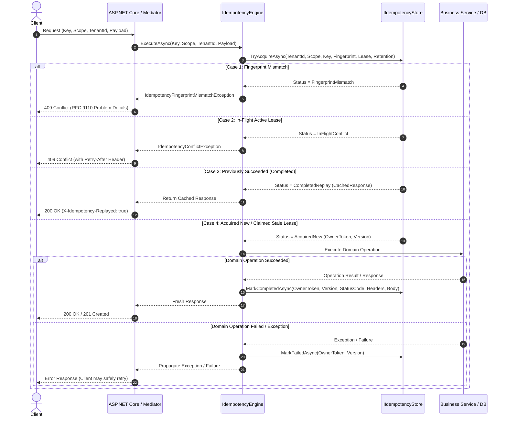

# Architecture Guide: EricksonLopez.Idempotency

// Copyright © Erickson Lopez. MIT License.  
Author: Erickson López (<ericksonlopezf@gmail.com>)

---

## 1. Architectural Philosophy

`EricksonLopez.Idempotency` is built around **Clean Architecture**, **Hexagonal Architecture (Ports & Adapters)**, and **Domain-Driven Design (DDD)**. It enforces strict separation of concerns across the EricksonLopez enterprise ecosystem:

```text
Idempotency   ≠   Concurrency   ≠   Transactions   ≠   Outbox   ≠   Resilience   ≠   Result
("Is this the       ("Did the        ("Are these       ("How do we      ("How do we      ("How is the
 same logical        underlying       operations        publish          recover from     outcome
 operation?")        state change?")  atomic?")         events safely?") failures?")      represented?")
```

---

## 2. Component Architecture Diagram

```mermaid
flowchart TD
    subgraph Ports["Ports & Domain Contracts (Abstractions)"]
        IK[IdempotencyKey]
        IS[IdempotencyScope]
        ICR[IdempotencyClaimResult]
        StorePort[IIdempotencyStore SPI]
        TxStorePort[ITransactionalIdempotencyStore SPI]
    end

    subgraph Core["Core Engine (EricksonLopez.Idempotency)"]
        Engine[IdempotencyEngine<br/>State Machine]
        Hasher[IdempotencyFingerprintHasher<br/>SHA-256 / Spans]
        Serializer[SystemTextJsonIdempotencySerializer<br/>Source Generated Native AOT]
        Diagnostics[IdempotencyDiagnostics<br/>OpenTelemetry Tracer & Meter]
        Engine --> StorePort
        Engine --> Hasher
        Engine --> Serializer
        Engine --> Diagnostics
    end

    subgraph Presentation["Presentation & Pipeline Adapters"]
        AspNetCore[EricksonLopez.Idempotency.AspNetCore<br/>Middleware & Endpoint Filters]
        Mediator[EricksonLopez.Idempotency.Mediator<br/>IdempotencyPipelineBehavior]
        Result[EricksonLopez.Idempotency.Result<br/>IdempotencyErrors & Monads]
        AspNetCore --> Engine
        Mediator --> Engine
        Result --> StorePort
    end

    subgraph Persistence["Storage Adapters (Infrastructure Layer)"]
        PG[PostgreSql Provider<br/>Npgsql + Dapper]
        SS[SqlServer Provider<br/>SqlClient + Dapper]
        MY[MySql / MariaDb Providers<br/>MySqlConnector + Dapper]
        ORA[Oracle Provider<br/>OracleClient + Dapper]
        SQ[Sqlite Provider<br/>Microsoft.Data.Sqlite]
        RD[Redis Provider<br/>StackExchange.Redis + Lua]
        MEM[Testing Provider<br/>InMemory Concurrent Dictionary]

        PG -.-> StorePort
        PG -.-> TxStorePort
        SS -.-> StorePort
        SS -.-> TxStorePort
        MY -.-> StorePort
        MY -.-> TxStorePort
        ORA -.-> StorePort
        ORA -.-> TxStorePort
        SQ -.-> StorePort
        SQ -.-> TxStorePort
        RD -.-> StorePort
        MEM -.-> StorePort
    end
```



---

## 3. Layer Separation Invariants

1. **Abstractions Layer (`EricksonLopez.Idempotency.Abstractions`)**:
   - Zero dependencies on ASP.NET Core, database drivers, Dapper, Redis, or external frameworks.
   - Contains pure contracts (`IIdempotencyStore`, `ITransactionalIdempotencyStore`, `IIdempotencyFingerprintGenerator`, `IIdempotencySerializer`), immutable Value Objects (`IdempotencyKey`, `IdempotencyScope`), and domain exceptions.

2. **Core Engine (`EricksonLopez.Idempotency`)**:
   - Contains the execution state machine (`IdempotencyEngine`), canonical SHA-256 fingerprint hasher (`IdempotencyFingerprintHasher`), and OpenTelemetry diagnostics (`IdempotencyDiagnostics`).
   - Decoupled from persistence engines and presentation frameworks.

3. **Adapters & Providers Layer**:
   - `EricksonLopez.Idempotency.PostgreSql`: PostgreSQL persistence utilizing Dapper, raw parameterized SQL, `ON CONFLICT`, lease fencing, and `ITransactionalIdempotencyStore` support.
   - `EricksonLopez.Idempotency.SqlServer`: SQL Server persistence with `MERGE WITH (HOLDLOCK)` and `ITransactionalIdempotencyStore` support.
   - `EricksonLopez.Idempotency.MySql` / `MariaDb` / `Oracle` / `Sqlite`: Native SQL dialect storage adapters.
   - `EricksonLopez.Idempotency.Redis`: High-throughput Redis storage provider with atomic Lua scripts for cloud-native workloads.
   - `EricksonLopez.Idempotency.Testing`: Thread-safe in-memory double for deterministic unit and integration tests.
   - `EricksonLopez.Idempotency.AspNetCore`: HTTP pipeline filters (`.WithIdempotency()`), middleware, and `[Idempotent]` attribute for ASP.NET Core.
   - `EricksonLopez.Idempotency.Mediator`: Command pipeline interceptor (`IdempotencyPipelineBehavior`) enforcing idempotency before handler execution.
   - `EricksonLopez.Idempotency.Result`: Functional mapping between claim conflicts and domain `Result<T>` errors.

---

## 4. End-to-End Execution Sequence



---

## 5. Ecosystem Compatibility Matrix

| Library | Architectural Role | Interaction with Idempotency |
|---|---|---|
| `EricksonLopez.Result` | Result Monad & Error Model | Stores and replays outcome statuses without throwing unnecessary control-flow exceptions. |
| `EricksonLopez.Mediator` | Command Pipeline Dispatcher | `IdempotencyPipelineBehavior` wraps commands implementing `IIdempotentRequest`. |
| `EricksonLopez.Transactions` | Transactional Boundaries | Ensures domain state, outbox events, and idempotency completion commit atomically. |
| `EricksonLopez.Outbox` | Reliable Event Publishing | Prevents duplicate outbox messages when a duplicate request is received. |
| `EricksonLopez.Concurrency` | Optimistic Concurrency | Prevents stale updates on state while idempotency prevents duplicate command attempts. |
| `EricksonLopez.Resilience` | Retries and Fault Tolerance | Wraps outer calls or inner calls without producing duplicate side-effects. |

---

## 6. Architecture Decision Records

All significant design decisions, tradeoffs, and systematic rejections are documented in the `docs/adr/` directory.

See the [ADR Index](adr/adr-index.md) for a navigable overview of all 17 ADRs.
