# Build, CI/CD, and Quality Engineering Guide

// Copyright © Erickson Lopez. MIT License.  
Author: Erickson López (<ericksonlopezf@gmail.com>)

---

## 1. System Overview & Build Lifecycle

`EricksonLopez.Idempotency` enforces strict compile-time and runtime quality standards across all 31 solution projects (13 published NuGet packages, 16 test projects, 1 benchmark suite, and 1 interactive showcase application).

```mermaid
flowchart TD
    subgraph CI["Continuous Integration Pipeline (ci.yml)"]
        PushPR[Git Push / PR to main, develop] --> JobBT[Job 1: Build, Test & Coverage<br/>dotnet-build-test.yml]
        PushPR --> JobAOT[Job 2: Native AOT Smoke Test<br/>aot-smoke-test.yml]
        JobBT --> GreenCI[Green CI Gate]
        JobAOT --> GreenCI
    end

    subgraph Governance["Repository Governance (repo-compliance.yml)"]
        GovPush[Push / PR to main] --> CompScript[verify-compliance.ps1<br/>Invariants & Architecture]
        CompScript --> BuildRel[dotnet build -c Release<br/>TreatWarningsAsErrors]
        BuildRel --> UnitT[dotnet test<br/>Unit & Architecture]
        UnitT --> PackVal[dotnet pack artifacts/]
    end

    subgraph Quality["Quality & Regression Gates"]
        PR_Code[PR touching src/** or benchmarks/**] --> BRG[Benchmark Regression Gate<br/>verify-benchmark-gate.ps1 &lt;= 5%]
        Cron_Mon[Weekly Cron Schedule Mon 04:00 UTC] --> Stryker[Mutation Testing Matrix<br/>13 Packages Quality Gate]
        DispatchMut[workflow_dispatch Mutation Level] --> Stryker
        Cron_Sun[Weekly Cron Schedule Sun 02:00 UTC] --> WeeklyBench[Weekly Deep Benchmarks<br/>Baseline Commit on main]
        Stryker --> Record[scripts/record-stryker-result.js]
        Record --> GateStatus[Consolidated Gate: mutation-testing/stryker]
    end

    subgraph Release["Release Pipeline (publish.yml & release-please.yml)"]
        RP[Release Please Action] -->|Merge Release PR| TagRelease[GitHub Tag vX.Y.Z]
        TagRelease --> RPDispatch[workflow_dispatch publish.yml]
        RPDispatch --> MutGateCheck[Verify Mutation Quality Gate<br/>scripts/verify-mutation-gate.js]
        MutGateCheck -->|Pass| PackAll[dotnet pack 13 Packages]
        PackAll --> AttestSig[Sigstore Build Provenance Attestation<br/>actions/attest-build-provenance]
        AttestSig --> LoginOIDC[NuGet Login via OIDC<br/>NuGet/login]
        LoginOIDC --> PushNuGet[dotnet nuget push --skip-duplicate]
        PushNuGet --> GHRel[Create GitHub Release]
    end
```



---

## 2. GitHub Actions Workflows Catalog

The repository defines 10 GitHub Actions workflows organized into orchestrated pipelines, quality gates, and release automations.

### 2.1 Continuous Integration (`.github/workflows/ci.yml`)

The primary CI entry point triggered on every push and pull request. Designed for fast feedback without blocking PR merges.

- **File**: `.github/workflows/ci.yml`
- **Triggers**:
  - `push` to `main`, `develop`
  - `pull_request` to `main`, `develop`
- **Jobs & Dependencies**:
  1. `build-and-test`: Calls `.github/workflows/dotnet-build-test.yml` with `artifact-name: test-results`.
  2. `aot-smoke-test`: Calls `.github/workflows/aot-smoke-test.yml`.
- **Secrets Passed**: `SNK_KEY`, `CODECOV_TOKEN`, `SONAR_TOKEN`.
- **Quality Policy**: Mutation testing and long benchmarks are intentionally decoupled from this pipeline to maintain fast PR feedback cycles.

---

### 2.2 Repository Compliance (`.github/workflows/repo-compliance.yml`)

Verifies architectural governance, code cleanliness, and repository invariants.

- **File**: `.github/workflows/repo-compliance.yml`
- **Triggers**:
  - `push` to `main`
  - `pull_request` to `main`
  - `workflow_dispatch`
- **Runner**: `ubuntu-latest` (Timeout: 15 minutes)
- **Steps**:
  1. Checkout repository (`actions/checkout@v4`).
  2. Setup .NET 10 SDK (`10.0.x`).
  3. Execute `pwsh ./scripts/verify-compliance.ps1` to enforce:
     - Documentation naming in `docs/` uses `kebab-case.md`.
     - Zero `[Obsolete]` attribute usages in production code (`src/`).
     - Canonical MIT copyright header (`// Copyright © Erickson Lopez. MIT License.`) across all source files.
     - "One Type Per File" invariant across `src/`.
     - Canonical repository URL (`ericksonlopezf/dotnet-idempotency`).
     - Canonical contact email normalization (`ericksonlopezf@gmail.com`).
     - Zero prohibited compiler `<NoWarn>` suppressions.
  4. Restore dependencies (`dotnet restore EricksonLopez.Idempotency.slnx`).
  5. Build with strict diagnostics (`dotnet build EricksonLopez.Idempotency.slnx --configuration Release`).
  6. Run unit and architecture tests (`dotnet test --filter "FullyQualifiedName!~IntegrationTests"`).
  7. Validate packaging (`dotnet pack EricksonLopez.Idempotency.slnx --configuration Release -o artifacts/`).

---

### 2.3 Build, Test & Coverage (`.github/workflows/dotnet-build-test.yml`)

Compiles the solution across target frameworks, executes tests with code coverage, and publishes reports.

- **File**: `.github/workflows/dotnet-build-test.yml`
- **Triggers**: `workflow_call` (inputs: `dotnet-version`, `test-filter`, `test-project`, `upload-coverage`, `artifact-name`)
- **Runner**: `ubuntu-latest`
- **Secrets**: `SNK_KEY` (optional), `CODECOV_TOKEN` (optional), `SONAR_TOKEN` (optional)
- **Steps**:
  1. Checkout repository (`actions/checkout@v4`, `fetch-depth: 0`).
  2. Setup .NET SDK (`dotnet-version`, default: `10.0.x`).
  3. Restore Strong Name signing key from base64 `SNK_KEY` to `EricksonLopez.snk`.
  4. Setup Java 17 (Temurin) for SonarScanner.
  5. Install `dotnet-sonarscanner` global tool.
  6. Begin Sonar analysis (if `SONAR_TOKEN` is present) with OpenCover reports paths and coverage exclusions.
  7. Build solution in `Release` configuration (`dotnet build EricksonLopez.Idempotency.slnx`).
  8. Execute tests (`dotnet test`) with `.runsettings`, TRX logger, and XPlat Code Coverage (OpenCover, Cobertura).
  9. End Sonar analysis.
  10. Upload TRX test results artifact (`actions/upload-artifact@v7`).
  11. Upload coverage report to Codecov via `codecov/codecov-action@v7` (flags: `unittests`).

---

### 2.4 Native AOT Smoke Test (`.github/workflows/aot-smoke-test.yml`)

Validates 100% Native AOT compilation and execution under Linux x64 without runtime crashes or trimming issues.

- **File**: `.github/workflows/aot-smoke-test.yml`
- **Triggers**:
  - `workflow_call`
  - `push` to `main`, `develop`
  - `pull_request` to `main`, `develop`
  - `workflow_dispatch`
- **Runner**: `ubuntu-latest` (Timeout: 20 minutes)
- **Secrets**: `SNK_KEY` (optional)
- **Steps**:
  1. Setup multi-version .NET SDKs (`8.0.x`, `9.0.x`, `10.0.x`).
  2. Restore Strong Name key `EricksonLopez.snk`.
  3. Install Native AOT prerequisites (`clang`, `lld`, `zlib1g-dev`).
  4. Restore dependencies and build in `Release` configuration.
  5. Publish Native AOT binary:
     ```bash
     dotnet publish tests/EricksonLopez.Idempotency.AotSmokeTest/EricksonLopez.Idempotency.AotSmokeTest.csproj \
       --configuration Release \
       --runtime linux-x64 \
       --self-contained \
       -p:TreatWarningsAsErrors=true \
       -p:WarningLevel=5 \
       --output ./aot-output
     ```
  6. Execute native binary `./aot-output/EricksonLopez.Idempotency.AotSmokeTest` to verify zero runtime reflection or trimming crashes.
  7. Upload AOT artifacts on failure for diagnostic inspection (`actions/upload-artifact@v7`).

---

### 2.5 Publish Packages (`.github/workflows/publish.yml`)

Packs, signs, attests, and publishes all 13 NuGet packages upon release creation after verifying the mutation quality gate.

- **File**: `.github/workflows/publish.yml`
- **Triggers**:
  - `push` tags: `v*.*.*`
  - `workflow_dispatch` (input: `version`)
- **Permissions**:
  - `id-token: write` (for Sigstore OIDC attestation & NuGet OIDC login)
  - `contents: write` (for GitHub Release creation)
  - `attestations: write` (for `actions/attest-build-provenance`)
- **Jobs**:
  1. `mutation-gate-check`: Evaluates `scripts/verify-mutation-gate.js` to determine whether main branch mutation tests passed.
  2. `stryker-gate`: Conditionally executes `.github/workflows/mutation-testing.yml` with level `Standard` if mutation evidence is missing.
  3. `publish`:
     - Resolves version (workflow input → git tag → `Directory.Build.props`).
     - Restores Strong Name key from `SNK_KEY`.
     - Builds in `Release` configuration.
     - Runs full test suite with coverage upload.
     - Packs all 13 packages into `./nupkgs/` with `-p:VersionPrefix=$VERSION`.
     - Generates Sigstore Provenance Attestation via `actions/attest-build-provenance@v2.2.3`.
     - Authenticates to NuGet.org via short-lived OIDC token using `NuGet/login@v1` (`user: ericksonlopezf`).
     - Pushes all `.nupkg` files with `--skip-duplicate`.
     - Creates GitHub Release with ecosystem package table and CHANGELOG link (for tag triggers).

---

### 2.6 Semantic Release Automation (`.github/workflows/release-please.yml`)

Automates version bumping, changelog generation, and triggers package publishing based on Conventional Commits.

- **File**: `.github/workflows/release-please.yml`
- **Triggers**: `push` to `main`
- **Permissions**: `contents: write`, `pull-requests: write`
- **Action**: `googleapis/release-please-action@v4` with `.release-please-config.json` and `.release-please-manifest.json`.
- **Orchestration**: When a release is created, uses `actions/github-script@v7` to trigger `publish.yml` via `workflow_dispatch` with the newly bumped version.

---

### 2.7 Mutation Testing Matrix (`.github/workflows/mutation-testing.yml`)

Performs comprehensive mutation testing using Stryker.NET across all 13 packages.

- **File**: `.github/workflows/mutation-testing.yml`
- **Triggers**:
  - `workflow_call` (input: `mutation-level`, default: `Standard`)
  - `workflow_dispatch` (input: `mutation-level`, options: `Basic`, `Standard`, `Advanced`)
  - Scheduled cron: `0 4 * * 1` (Weekly Mondays at 04:00 UTC)
- **Concurrency**: `group: mutation-testing-${{ github.ref }}`, `cancel-in-progress: true`.
- **Jobs**:
  1. `mutation-test`: Matrix across all 13 packages (`Core`, `Abstractions`, `AspNetCore`, `MariaDb`, `Mediator`, `MySql`, `Oracle`, `PostgreSql`, `Redis`, `Result`, `Sqlite`, `SqlServer`, `Testing`).
     - Runs `dotnet-stryker` with package-specific config (`stryker-*-config.json`), `--concurrency 2`.
     - Extracts score via `scripts/record-stryker-result.js`.
     - Uploads HTML report and summary JSON artifacts.
     - Enforces Stryker exit code.
  2. `mutation-gate-summary`: Consolidated evaluation job.
     - Downloads all summary JSON artifacts.
     - Evaluates overall mutation score against thresholds:
       - `high`: ≥ 100% (`✅ HIGH`)
       - `low`: ≥ 98% (`🟡 LOW`)
       - `break`: ≥ 95% (`🟠 WARNING` for 95-97.99%; `❌ FAILED` for < 95%)
     - Publishes summary table to `$GITHUB_STEP_SUMMARY`.
     - Sets GitHub Commit Status `mutation-testing/stryker` on the commit SHA.
     - If passing, updates README.md mutation score badge and commits with `[skip ci]`.

---

### 2.8 Benchmark Regression Gate (`.github/workflows/benchmark-regression-gate.yml`)

Protects against latency and memory allocation regressions in Pull Requests.

- **File**: `.github/workflows/benchmark-regression-gate.yml`
- **Triggers**:
  - `pull_request` to `main`, `develop` (paths: `src/**`, `benchmarks/**`)
  - `workflow_dispatch` (input: `threshold`, default: `5`%)
- **Steps**:
  1. Setup multi-version .NET SDKs (`8.0.x`, `9.0.x`, `10.0.x`).
  2. Build in `Release` configuration.
  3. Run benchmarks on PR head:
     ```bash
     dotnet run --project benchmarks/EricksonLopez.Idempotency.Benchmarks/EricksonLopez.Idempotency.Benchmarks.csproj \
       --configuration Release --framework net10.0 -- --filter "*" --job short --exporters json --memory --artifacts ./benchmarks/pr-results
     ```
  4. Evaluate regression gate via PowerShell:
     ```powershell
     ./scripts/verify-benchmark-gate.ps1 \
       -ReportDir ./benchmarks/pr-results \
       -BaselinePath ./benchmarks/results/baseline.json \
       -MaxLatencyRegressionPercent ([double]$env:REGRESSION_THRESHOLD)
     ```
  5. Invariants enforced:
     - Zero heap allocation (0 B) on zero-alloc hot path benchmarks.
     - Mean latency regression does not exceed the threshold (default: 5%).
  6. Uploads PR benchmark results artifact (`actions/upload-artifact@v4`).

---

### 2.9 Benchmarks Runner (`.github/workflows/benchmarks.yml`)

Runs BenchmarkDotNet suites on demand with custom filtering.

- **File**: `.github/workflows/benchmarks.yml`
- **Triggers**: `workflow_call`, `workflow_dispatch` (input: `benchmark-filter`, default: `*`)
- **Steps**:
  1. Setup multi-version .NET SDKs.
  2. Restore Strong Name key.
  3. Run benchmarks with `--framework net10.0 --filter "${{ inputs.benchmark-filter }}" --job short --exporters json markdown`.
  4. Upload benchmark results artifact (`actions/upload-artifact@v7`).
  5. Post markdown summaries to `$GITHUB_STEP_SUMMARY`.

---

### 2.10 Weekly Deep Benchmarks (`.github/workflows/weekly-benchmarks.yml`)

Weekly scheduled job running rigorous multi-framework benchmarks (.NET 8, 9, 10) with the default job configuration.

- **File**: `.github/workflows/weekly-benchmarks.yml`
- **Triggers**:
  - Scheduled cron: `0 2 * * 0` (Weekly Sundays at 02:00 UTC)
  - `workflow_dispatch` (input: `benchmark-filter`, default: `*`)
- **Steps**:
  1. Setup multi-version .NET (`8.0.x`, `9.0.x`, `10.0.x`).
  2. Restore dependencies and build in `Release` configuration.
  3. Run benchmarks across all runtimes (`--runtimes net8.0 net9.0 net10.0 --exporters json markdown`).
  4. Upload benchmark results artifact (90-day retention).
  5. If on branch (not tag), commit updated benchmark baselines in `benchmarks/results/` with `[skip ci]`.
  6. Post markdown summary to `$GITHUB_STEP_SUMMARY`.

---

## 3. Required CI/CD Secrets

| Secret Name | Referenced Workflows | Purpose |
|---|---|---|
| `SNK_KEY` | `ci.yml`, `dotnet-build-test.yml`, `aot-smoke-test.yml`, `publish.yml`, `mutation-testing.yml`, `benchmark-regression-gate.yml`, `benchmarks.yml`, `weekly-benchmarks.yml` | Base64-encoded Strong Name private signing key used to compile strongly-named assemblies. |
| `CODECOV_TOKEN` | `ci.yml`, `dotnet-build-test.yml`, `publish.yml` | Codecov repository upload token for aggregating test coverage metrics. |
| `SONAR_TOKEN` | `ci.yml`, `dotnet-build-test.yml` | SonarCloud authentication token for running Roslyn code analysis and publishing Quality Gate metrics. |

> [!NOTE]
> **OIDC Trusted Publishing**: `publish.yml` uses GitHub OIDC identity federation (`NuGet/login@v1` with `id-token: write`) to publish packages to NuGet.org dynamically without storing static API keys or credentials in repository secrets.

---

## 4. Central Package Management (CPM)

All external package versions are centrally pinned in [`Directory.Packages.props`](../Directory.Packages.props):

| Package Name | Pinned Version | Category |
|---|---|---|
| `Microsoft.Extensions.DependencyInjection` | `10.0.11` | Microsoft Extensions |
| `Microsoft.Extensions.DependencyInjection.Abstractions` | `10.0.11` | Microsoft Extensions |
| `Microsoft.Extensions.Logging` | `10.0.11` | Microsoft Extensions |
| `Microsoft.Extensions.Logging.Abstractions` | `10.0.11` | Microsoft Extensions |
| `Microsoft.Extensions.Logging.Console` | `10.0.11` | Microsoft Extensions |
| `Microsoft.Extensions.Options` | `10.0.11` | Microsoft Extensions |
| `Microsoft.Extensions.Hosting` | `10.0.11` | Microsoft Extensions |
| `Microsoft.Extensions.Hosting.Abstractions` | `10.0.11` | Microsoft Extensions |
| `Microsoft.AspNetCore.Http` | `2.3.0` | ASP.NET Core |
| `Microsoft.AspNetCore.Http.Abstractions` | `2.3.0` | ASP.NET Core |
| `OpenTelemetry.Api` | `1.18.0` | Observability |
| `Dapper` | `2.1.79` | Data Access |
| `Npgsql` | `10.0.3` | Database Driver |
| `Microsoft.Data.SqlClient` | `7.0.2` | Database Driver |
| `MySqlConnector` | `2.6.2` | Database Driver |
| `Oracle.ManagedDataAccess.Core` | `23.26.300` | Database Driver |
| `Microsoft.Data.Sqlite` | `10.0.11` | Database Driver |
| `SQLitePCLRaw.bundle_e_sqlite3` | `2.1.11` | SQLite Runtime |
| `SQLitePCLRaw.lib.e_sqlite3` | `2.1.11` | SQLite Runtime |
| `StackExchange.Redis` | `3.1.31` | Caching / Redis |
| `EricksonLopez.Result` | `2.0.0` | Ecosystem Monad |
| `EricksonLopez.Mediator` | `1.0.0` | Ecosystem Mediator |
| `BenchmarkDotNet` | `0.15.8` | Benchmarking |
| `Microsoft.NET.Test.Sdk` | `17.13.0` | Testing |
| `xunit` | `2.9.3` | Testing |
| `xunit.runner.visualstudio` | `2.8.2` | Testing |
| `AwesomeAssertions` | `9.6.0` | Testing Assertions |
| `NSubstitute` | `6.2.0` | Mocking |
| `coverlet.collector` | `6.0.4` | Code Coverage |
| `coverlet.msbuild` | `6.0.4` | Code Coverage |
| `NetArchTest.Rules` | `1.3.2` | Architecture Testing |
| `Microsoft.SourceLink.GitHub` | `8.0.0` | SourceLink Packaging |

---

## 5. Quality Gates & Enforcement Scripts

1. **Zero Warnings Policy**: Enforced via `<TreatWarningsAsErrors>true</TreatWarningsAsErrors>` in `Directory.Build.props`.
2. **Native AOT Trimming Analyzer**: `<EnableTrimAnalyzer>true</EnableTrimAnalyzer>` and `<IsAotCompatible>true</IsAotCompatible>`.
3. **Repository Compliance**: `scripts/verify-compliance.ps1` runs in CI to enforce naming conventions, copyright headers, one-type-per-file, and clean API boundaries.
4. **Markdown Link Integrity**: `scripts/verify-links.ps1` validates that all relative links resolve and no local absolute paths leak into documentation.
5. **Mutation Testing Quality Gate (Stryker.NET)**:
   - `scripts/record-stryker-result.js`: Extracts and evaluates per-package mutation scores against thresholds (`break: 95`, `low: 98`, `high: 100`).
   - `scripts/verify-mutation-gate.js`: Verifies mutation quality gate evidence on main commits before allowing publication in `publish.yml`.
6. **Benchmark Regression Gate**:
   - `scripts/verify-benchmark-gate.ps1`: Automated regression detection asserting ≤ 5% mean latency regression against `benchmarks/results/baseline.json` and 0 B heap allocation on zero-alloc benchmarks.


