# Build, CI/CD, and Quality Engineering Guide

// Copyright © Erickson Lopez. MIT License.  
Author: Erickson López (<ericksonlopezf@gmail.com>)

---

## 1. System Overview & Build Lifecycle

`EricksonLopez.Idempotency` enforces strict compile-time and runtime quality standards across all 31 solution projects (13 published NuGet packages, 16 test projects, 1 benchmark suite, and 1 interactive showcase application).

```mermaid
flowchart TD
    subgraph CI["Continuous Integration Pipeline (ci.yml - Fast PR Gate ~2-3 mins)"]
        A[Git Push / PR] --> B[Job 1: Repo Compliance]
        B -->|verify-compliance.ps1| C[Job 2: Build, Test & Coverage]
        C -->|dotnet test + Coverlet| D[Job 3: Native AOT Smoke Test]
        D -->|dotnet publish AOT linux-x64| E[Green CI Gate - PR Unblocked]
    end

    subgraph Quality["Quality & Deferred Regression Gates"]
        PR_Code[PR touching src/** or benchmarks/**] --> BRG[Benchmark Regression Gate<br/>10% threshold check]
        Cron_Sun[Weekly Cron Schedule] --> Stryker[Mutation Testing Matrix<br/>13 Packages Quality Gate]
        Dispatch[workflow_dispatch Level: Basic/Standard/Advanced] --> Stryker
        Call[workflow_call / Reusable Quality Gate] --> Stryker
        Cron_Sun --> WeeklyBench[Weekly Deep Benchmarks<br/>Baseline Commit on main]
        Stryker --> Record[Record & Aggregate Results]
        Record --> GateStatus[Commit Status: quality-gate/stryker-mutation]
    end

    subgraph Release["Release Pipeline (publish.yml & release-please.yml)"]
        RP[Release Please Action] -->|Creates Release PR / Tag| RelEvent[GitHub Release Published]
        RelEvent --> GateCheck[Verify Mutation Gate on Commit SHA<br/>verify-stryker-gate.js]
        GateCheck -->|Score >= 95% Verified| Pack[dotnet pack -c Release]
        Pack --> PushNuGet[Push to NuGet.org via OIDC / API Key]
    end
```

---

## 2. GitHub Actions Workflows Catalog

The repository defines 10 GitHub Actions workflows organized into orchestrated pipelines, quality gates, and release automations.

### 2.1 Continuous Integration (`.github/workflows/ci.yml`)

The primary CI entry point triggered on every push and pull request. Designed for fast feedback without blocking PR merges.

- **File**: `.github/workflows/ci.yml`
- **Triggers**:
  - `push` to `main`, `develop` (ignoring `**.md`, `docs/**`)
  - `pull_request` to `main`, `develop` (ignoring `**.md`, `docs/**`)
- **Jobs & Dependencies**:
  1. `compliance`: Invokes `repo-compliance.yml`.
  2. `build-and-test`: Invokes `dotnet-build-test.yml` (requires `compliance`).
  3. `aot-smoke-test`: Invokes `aot-smoke-test.yml` (requires `build-and-test`).
- **Secrets Passed**: `SNK_KEY`, `CODECOV_TOKEN`.
- **Quality Policy**: Mutation testing is intentionally decoupled from this pipeline to maintain sub-5-minute PR feedback cycles.

---

### 2.2 Repository Compliance (`.github/workflows/repo-compliance.yml`)

Verifies architectural governance, code cleanliness, and repository invariants.

- **File**: `.github/workflows/repo-compliance.yml`
- **Triggers**: `workflow_call`, `workflow_dispatch`, `pull_request`
- **Runner**: `ubuntu-latest`
- **Steps**:
  - Checks out repository.
  - Executes `pwsh -File scripts/verify-compliance.ps1` to enforce:
    1. Documentation naming in `docs/` uses `kebab-case.md`.
    2. Zero `[Obsolete]` attribute usages in production code (`src/`).
    3. Canonical MIT copyright header (`// Copyright © Erickson Lopez. MIT License.`) across all C# files.
    4. "One Type Per File" invariant across `src/`.
    5. Official repository URL target (`ericksonlopezf/dotnet-idempotency`).
    6. Canonical contact email normalization (`ericksonlopezf@gmail.com`).

---

### 2.3 Build, Test & Coverage (`.github/workflows/dotnet-build-test.yml`)

Compiles the solution across target frameworks, executes tests with code coverage, and publishes reports.

- **File**: `.github/workflows/dotnet-build-test.yml`
- **Triggers**: `workflow_call`, `workflow_dispatch`
- **Runner**: `ubuntu-latest` (Timeout: 30 minutes)
- **Secrets**: `SNK_KEY` (optional), `CODECOV_TOKEN` (optional), `SONAR_TOKEN` (optional)
- **Steps**:
  1. Setup Java 17 (Temurin) for SonarScanner.
  2. Setup .NET SDKs for multi-targeting: `8.0.x`, `9.0.x`, `10.0.x`.
  3. Restore Strong Name signing key from `SNK_KEY` to `EricksonLopez.snk`.
  4. Install `dotnet-sonarscanner` global tool.
  5. `dotnet restore EricksonLopez.Idempotency.slnx` using Central Package Management.
  6. Execute `dotnet-sonarscanner begin` with OpenCover, TRX reports paths, and test exclusions.
  7. `dotnet build EricksonLopez.Idempotency.slnx --no-restore --configuration Release` (`TreatWarningsAsErrors=true`).
  8. `dotnet test EricksonLopez.Idempotency.slnx` with `XPlat Code Coverage` (OpenCover and Cobertura formats) and TRX test logger.
  9. Execute `dotnet-sonarscanner end` to publish SonarCloud quality gate analysis.
  10. Upload TRX test results as GitHub Actions artifact (`test-results-${{ github.run_id }}`).
  11. Upload coverage reports to Codecov via `codecov/codecov-action@v4`.

---

### 2.4 Native AOT Smoke Test (`.github/workflows/aot-smoke-test.yml`)

Validates 100% Native AOT compilation and execution under Linux x64 without runtime crashes or trimming issues.

- **File**: `.github/workflows/aot-smoke-test.yml`
- **Triggers**: `workflow_call`, `workflow_dispatch`
- **Runner**: `ubuntu-latest` (Timeout: 20 minutes)
- **Secrets**: `SNK_KEY` (optional)
- **Steps**:
  1. Setup .NET 10 (`10.0.x`).
  2. Restore Strong Name key `EricksonLopez.snk`.
  3. `dotnet publish tests/EricksonLopez.Idempotency.AotSmokeTest/EricksonLopez.Idempotency.AotSmokeTest.csproj -c Release -r linux-x64 --self-contained -o ./aot-output`.
  4. Execute compiled Native AOT binary `./aot-output/EricksonLopez.Idempotency.AotSmokeTest` to verify zero runtime reflection failures.

---

### 2.5 Publish Packages (`.github/workflows/publish.yml`)

Packs and publishes all 13 NuGet packages to NuGet.org upon release creation after verifying the mutation quality gate.

- **File**: `.github/workflows/publish.yml`
- **Triggers**:
  - `release` (types: `[ published ]`)
  - `workflow_dispatch` (with optional `skip_mutation_gate` boolean input)
- **Runner**: `ubuntu-latest` (Timeout: 20 minutes)
- **Secrets**: `SNK_KEY`, `NUGET_API_KEY`
- **Jobs & Quality Gate**:
  1. `verify-mutation-gate`: Runs `python3 scripts/verify-stryker-gate.py` against `github.sha` to inspect pre-recorded mutation test evidence without re-executing Stryker.
     - **Policy**: `mutation score >= 95%` -> Release permitted; `mutation score < 95%` or unverified -> Release blocked.
  2. `publish`: Packs (`dotnet pack -c Release`) and pushes to `api.nuget.org`.

---

### 2.6 Semantic Release Automation (`.github/workflows/release-please.yml`)

Automates version bumping, changelog generation, and GitHub release creation based on Conventional Commits.

- **File**: `.github/workflows/release-please.yml`
- **Triggers**: `push` to `main`
- **Permissions**: `contents: write`, `pull-requests: write`
- **Action**: `googleapis/release-please-action@v4` with `release-type: simple`.

---

### 2.7 Mutation Testing Matrix (`.github/workflows/mutation-testing.yml`)

Performs comprehensive mutation testing using Stryker.NET as a dedicated Quality Gate for releases, weekly audit schedules, and on-demand dispatches (not on every push).

- **File**: `.github/workflows/mutation-testing.yml`
- **Triggers**:
  - `workflow_call`: Reusable quality gate invocation with optional `level` and `package` inputs.
  - Scheduled cron: `0 3 * * 0` (Weekly Sundays at 03:00 UTC)
  - `workflow_dispatch` with inputs:
    - `level`: `Basic` (tier-0 core packages), `Standard` (all 13 packages default), `Advanced` (all 13 packages full depth).
    - `package`: `all` or specific package selector.
- **Concurrency**: `group: mutation-testing-${{ github.ref }}`, `cancel-in-progress: true` to prevent resource starvation.
- **Runner Timeout**: `180 minutes` (3 hours) per matrix job to accommodate deep Roslyn mutation analysis across the 13 package test suites without false timeouts.
- **Strategy Matrix**: 13 packages (`core`, `abstractions`, `aspnetcore`, `mariadb`, `mediator`, `mysql`, `oracle`, `postgresql`, `redis`, `result`, `sqlite`, `sqlserver`, `testing`).
- **Threshold Policy (Single Source of Truth: `stryker-config.json`)**:
  - `high = 100` (`✅ HIGH`)
  - `low = 98` (`🟡 LOW`)
  - `break = 95` (`🟠 WARNING` for 95-97.99%; `❌ FAILED` for <95%)
  - Only `< 95%` produces an automatic build failure.
- **Steps & Jobs**:
  1. `setup-matrix`: Resolves package matrix dynamically based on trigger and input level.
  2. `mutate`: Runs `dotnet-stryker` and records JSON/HTML reports via `scripts/extract-mutation-score.py`.
  3. `aggregate-and-gate`: Consolidates all package reports via `scripts/aggregate-stryker-manifest.py`, publishes unified Step Summary, uploads release manifest artifact, and sets GitHub Commit Status (`quality-gate/stryker-mutation`) on the commit SHA.

---

### 2.8 Benchmark Regression Gate (`.github/workflows/benchmark-regression-gate.yml`)

Protects the repository against performance and allocation regressions in Pull Requests.

- **File**: `.github/workflows/benchmark-regression-gate.yml`
- **Triggers**:
  - `pull_request` to `main`, `develop` (paths: `src/**`, `benchmarks/**`)
  - `workflow_dispatch` (with input `threshold`, default: `10`%)
- **Steps**:
  1. Setup .NET SDKs (`8.0.x`, `9.0.x`, `10.0.x`).
  2. Build in `Release` mode.
  3. Run benchmarks on PR head: `dotnet run --project benchmarks/EricksonLopez.Idempotency.Benchmarks --framework net10.0 -- --filter "*" --job short --runtimes net8.0 net10.0 --exporters json --artifacts ./benchmarks/pr-results`.
  4. Compare PR JSON results against baseline in `benchmarks/results/` using embedded Python analysis.
  5. Generate Markdown summary into `$GITHUB_STEP_SUMMARY`.
  6. Fails the build if any benchmark regressed beyond the configured threshold percentage.
  7. Uploads PR benchmark artifacts (`pr-benchmark-results-${{ github.run_id }}`).

---

### 2.9 Benchmarks Runner (`.github/workflows/benchmarks.yml`)

Reusable workflow to run benchmark suites on demand.

- **File**: `.github/workflows/benchmarks.yml`
- **Triggers**: `workflow_call`, `workflow_dispatch` (input: `benchmark-filter`, default: `*`)
- **Steps**:
  1. Setup .NET SDKs.
  2. Restore Strong Name key.
  3. Run `BenchmarkDotNet` with filter.
  4. Upload benchmark results artifact (`benchmark-results-${{ github.run_id }}`).
  5. Post markdown summaries to `$GITHUB_STEP_SUMMARY`.

---

### 2.10 Weekly Deep Benchmarks (`.github/workflows/weekly-benchmarks.yml`)

Weekly scheduled job that runs comprehensive benchmarks across TFMs and commits updated baseline results to `main`.

- **File**: `.github/workflows/weekly-benchmarks.yml`
- **Triggers**:
  - Scheduled cron: `0 2 * * 0` (Weekly Sundays at 02:00 UTC)
  - `workflow_dispatch`
- **Steps**:
  1. Setup multi-version .NET (`8.0.x`, `9.0.x`, `10.0.x`).
  2. Restore dependencies and build Release.
  3. Run cross-TFM benchmarks (`--runtimes net8.0 net9.0 net10.0`).
  4. Upload benchmark artifact (90-day retention).
  5. Commit and push updated baseline JSON files in `benchmarks/results/` to `main` with `[skip ci]`.

---

## 3. Required CI/CD Secrets

| Secret Name | Referenced Workflows | Purpose |
|---|---|---|
| `SNK_KEY` | `ci.yml`, `dotnet-build-test.yml`, `aot-smoke-test.yml`, `publish.yml`, `mutation-testing.yml`, `benchmark-regression-gate.yml`, `benchmarks.yml`, `weekly-benchmarks.yml` | Base64-encoded Strong Name private signing key used to compile strongly-named assemblies. |
| `CODECOV_TOKEN` | `ci.yml`, `dotnet-build-test.yml` | Codecov repository upload token for aggregating test coverage metrics. |
| `SONAR_TOKEN` | `ci.yml`, `dotnet-build-test.yml` | SonarCloud authentication token for running Roslyn code analysis and publishing Quality Gate metrics. |
| `NUGET_API_KEY` | `publish.yml` | API Key for authenticating package uploads to `api.nuget.org`. |

---

## 4. Central Package Management (CPM)

All external package versions are centrally pinned in [`Directory.Packages.props`](../Directory.Packages.props):

| Package Name | Pinned Version | Category |
|---|---|---|
| `Microsoft.Extensions.DependencyInjection` | `10.0.10` | Microsoft Extensions |
| `Microsoft.Extensions.DependencyInjection.Abstractions` | `10.0.10` | Microsoft Extensions |
| `Microsoft.Extensions.Logging` | `10.0.10` | Microsoft Extensions |
| `Microsoft.Extensions.Logging.Abstractions` | `10.0.10` | Microsoft Extensions |
| `Microsoft.Extensions.Logging.Console` | `10.0.10` | Microsoft Extensions |
| `Microsoft.Extensions.Options` | `10.0.10` | Microsoft Extensions |
| `Microsoft.Extensions.Hosting` | `10.0.10` | Microsoft Extensions |
| `Microsoft.Extensions.Hosting.Abstractions` | `10.0.10` | Microsoft Extensions |
| `Microsoft.AspNetCore.Http` | `2.3.0` | ASP.NET Core |
| `Microsoft.AspNetCore.Http.Abstractions` | `2.3.0` | ASP.NET Core |
| `OpenTelemetry.Api` | `1.11.2` | Observability |
| `Dapper` | `2.1.79` | Data Access |
| `Npgsql` | `10.0.3` | Database Driver |
| `Microsoft.Data.SqlClient` | `5.2.2` | Database Driver |
| `MySqlConnector` | `2.4.0` | Database Driver |
| `Oracle.ManagedDataAccess.Core` | `23.7.0` | Database Driver |
| `Microsoft.Data.Sqlite` | `10.0.3` | Database Driver |
| `SQLitePCLRaw.bundle_e_sqlite3` | `2.1.11` | SQLite Runtime |
| `SQLitePCLRaw.lib.e_sqlite3` | `2.1.11` | SQLite Runtime |
| `StackExchange.Redis` | `2.8.41` | Caching / Redis |
| `BenchmarkDotNet` | `0.15.8` | Benchmarking |
| `Microsoft.NET.Test.Sdk` | `17.14.1` | Testing |
| `xunit` | `2.9.3` | Testing |
| `xunit.runner.visualstudio` | `2.8.2` | Testing |
| `AwesomeAssertions` | `9.5.0` | Testing Assertions |
| `NSubstitute` | `5.3.0` | Mocking |
| `coverlet.collector` | `6.0.4` | Code Coverage |
| `coverlet.msbuild` | `10.0.1` | Code Coverage |
| `NetArchTest.Rules` | `1.3.2` | Architecture Testing |

---

## 5. Quality Gates & Enforcement Scripts

1. **Zero Warnings Policy**: Enforced via `<TreatWarningsAsErrors>true</TreatWarningsAsErrors>` in `Directory.Build.props`.
2. **Native AOT Trimming Analyzer**: `<EnableTrimAnalyzer>true</EnableTrimAnalyzer>` and `<IsAotCompatible>true</IsAotCompatible>`.
3. **Repository Compliance**: `scripts/verify-compliance.ps1` runs in CI to enforce naming conventions, copyright headers, one-type-per-file, and clean API boundaries.
4. **Markdown Link Integrity**: `scripts/verify-links.ps1` validates that all relative links resolve and no local absolute paths leak into documentation.
5. **Mutation Testing Gate (Stryker.NET)**:
   - `scripts/extract-mutation-score.py`: Evaluates package mutation scores against `stryker-config.json` thresholds.
   - `scripts/aggregate-stryker-manifest.py`: Aggregates the 13-package matrix, posts GitHub commit status `quality-gate/stryker-mutation`, and produces `stryker-release-manifest.json`.
   - `scripts/verify-stryker-gate.py`: Verifies mutation quality gate evidence on release commits without re-running Stryker.
6. **Benchmark Regression Gate**: Automated threshold comparison against recorded baseline results in PR pipelines.

