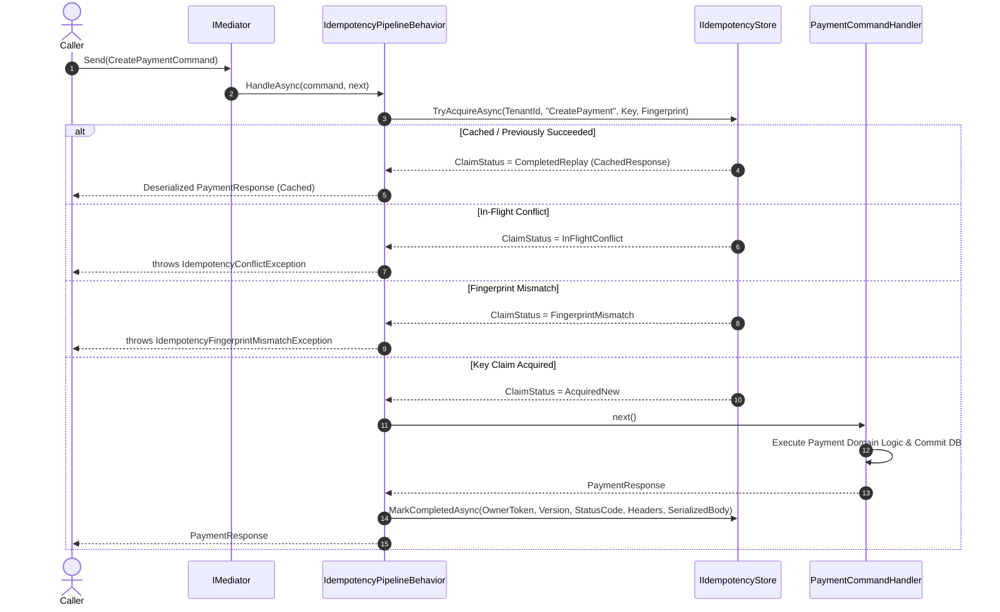

# Integration with EricksonLopez.Mediator

// Copyright © Erickson Lopez. MIT License.  
Author: Erickson López (<ericksonlopezf@gmail.com>)

---

## 1. Struct-Based Pipeline Behavior

`EricksonLopez.Idempotency.Mediator` integrates seamlessly with `EricksonLopez.Mediator` via a strongly-typed, struct-based pipeline behavior:

```csharp
public sealed class IdempotencyPipelineBehavior<TRequest, TResponse> : IPipelineBehavior<TRequest, TResponse>
    where TRequest : IIdempotentRequest
```

> **Note:** The behavior serializes `TRequest` via `IIdempotencySerializer` to compute the fingerprint on each invocation.
> This introduces a heap allocation proportional to the size of the request payload. The behavior is *struct-based* (integrated into the zero-allocation mediator pipeline), but fingerprint computation itself is not zero-allocation.

Commands that require idempotency implement the `IIdempotentRequest` interface:

```csharp
public interface IIdempotentRequest
{
    /// <summary>
    /// Gets the unique idempotency key associated with this request.
    /// </summary>
    IdempotencyKey IdempotencyKey { get; }

    /// <summary>
    /// Gets the tenant identifier for this request (or Guid.Empty in single-tenant systems).
    /// </summary>
    Guid TenantId { get; }
}
```

---

## 2. Modeling Idempotent Commands

```csharp
public sealed record CreatePaymentCommand(
    IdempotencyKey IdempotencyKey,
    Guid TenantId,
    Guid CustomerId,
    decimal Amount,
    string Currency) : IRequest<PaymentResponse>, IIdempotentRequest;
```

---

## 3. Pipeline Execution Flow



---

## 4. Service Registration

```csharp
services.AddEricksonLopezMediator(cfg =>
{
    cfg.RegisterServicesFromAssembly(typeof(CreatePaymentCommand).Assembly);
    cfg.AddOpenBehavior(typeof(IdempotencyPipelineBehavior<,>));
});
```
