# NuGet Packages & Ecosystem Matrix

// Copyright © Erickson Lopez. MIT License.  
Author: Erickson López (<ericksonlopezf@gmail.com>)

---

## 1. Package Catalog & Dependency Graph

`EricksonLopez.Idempotency` publishes 13 modular NuGet packages designed around Clean Architecture and the Single Responsibility Principle:

```mermaid
graph TD
    Abstractions["EricksonLopez.Idempotency.Abstractions<br/>(SPI / Value Objects / Contracts)"]
    Core["EricksonLopez.Idempotency<br/>(Engine / OTel / STJ Serializer)"]
    Testing["EricksonLopez.Idempotency.Testing<br/>(InMemory Store Double)"]
    Result["EricksonLopez.Idempotency.Result<br/>(Result Monad Adapter)"]
    AspNetCore["EricksonLopez.Idempotency.AspNetCore<br/>(Middleware & Minimal API Filters)"]
    Mediator["EricksonLopez.Idempotency.Mediator<br/>(Pipeline Behavior)"]
    PostgreSql["EricksonLopez.Idempotency.PostgreSql<br/>(Npgsql + Dapper)"]
    SqlServer["EricksonLopez.Idempotency.SqlServer<br/>(SqlClient + Dapper)"]
    MySql["EricksonLopez.Idempotency.MySql<br/>(MySqlConnector + Dapper)"]
    MariaDb["EricksonLopez.Idempotency.MariaDb<br/>(MySqlConnector + Dapper)"]
    Oracle["EricksonLopez.Idempotency.Oracle<br/>(OracleClient + Dapper)"]
    Sqlite["EricksonLopez.Idempotency.Sqlite<br/>(Microsoft.Data.Sqlite + Dapper)"]
    Redis["EricksonLopez.Idempotency.Redis<br/>(StackExchange.Redis + Lua)"]

    Core --> Abstractions
    Testing --> Abstractions
    Testing --> Core
    Result --> Abstractions
    Result --> Core
    AspNetCore --> Abstractions
    AspNetCore --> Core
    Mediator --> Abstractions
    Mediator --> Core
    PostgreSql --> Abstractions
    PostgreSql --> Core
    SqlServer --> Abstractions
    SqlServer --> Core
    MySql --> Abstractions
    MySql --> Core
    MariaDb --> Abstractions
    MariaDb --> Core
    MariaDb --> MySql
    Oracle --> Abstractions
    Oracle --> Core
    Sqlite --> Abstractions
    Sqlite --> Core
    Redis --> Abstractions
    Redis --> Core
```

---

## 2. Package Specifications

All packages multi-target modern supported .NET runtimes (`net8.0;net9.0;net10.0`):

| Package Name | Target Framework | Project / NuGet Dependencies | Purpose |
|---|---|---|---|
| [`EricksonLopez.Idempotency.Abstractions`](../src/EricksonLopez.Idempotency.Abstractions/EricksonLopez.Idempotency.Abstractions.csproj) | `net8.0;net9.0;net10.0` | None (0 external dependencies) | SPI contracts (`IIdempotencyStore`, `ITransactionalIdempotencyStore`), Value Objects (`IdempotencyKey`, `IdempotencyScope`), Enums, Models. |
| [`EricksonLopez.Idempotency`](../src/EricksonLopez.Idempotency/EricksonLopez.Idempotency.csproj) | `net8.0;net9.0;net10.0` | `Abstractions`, `Microsoft.Extensions.DependencyInjection.Abstractions`, `Microsoft.Extensions.Hosting.Abstractions`, `Microsoft.Extensions.Logging.Abstractions`, `OpenTelemetry.Api` | Central `IdempotencyEngine`, `IdempotencyFingerprintHasher`, Source-generated `SystemTextJsonIdempotencySerializer`, `IdempotencyDiagnostics`. |
| [`EricksonLopez.Idempotency.AspNetCore`](../src/EricksonLopez.Idempotency.AspNetCore/EricksonLopez.Idempotency.AspNetCore.csproj) | `net8.0;net9.0;net10.0` | `Abstractions`, `Core`, `Microsoft.AspNetCore.App` | `IdempotentEndpointFilter`, `IdempotencyMiddleware`, `[Idempotent]` attribute, `.WithIdempotency()`. |
| [`EricksonLopez.Idempotency.Mediator`](../src/EricksonLopez.Idempotency.Mediator/EricksonLopez.Idempotency.Mediator.csproj) | `net8.0;net9.0;net10.0` | `Abstractions`, `Core`, `EricksonLopez.Mediator` | `IIdempotentRequest`, `IdempotencyPipelineBehavior<TRequest, TResponse>`. |
| [`EricksonLopez.Idempotency.Result`](../src/EricksonLopez.Idempotency.Result/EricksonLopez.Idempotency.Result.csproj) | `net8.0;net9.0;net10.0` | `Abstractions`, `Core`, `EricksonLopez.Result` | `IdempotencyErrors` domain error factories, `AsErrorResult<T>()`. |
| [`EricksonLopez.Idempotency.Testing`](../src/EricksonLopez.Idempotency.Testing/EricksonLopez.Idempotency.Testing.csproj) | `net8.0;net9.0;net10.0` | `Abstractions`, `Core` | `InMemoryIdempotencyStore` for fast unit tests and development. |
| [`EricksonLopez.Idempotency.PostgreSql`](../src/EricksonLopez.Idempotency.PostgreSql/EricksonLopez.Idempotency.PostgreSql.csproj) | `net8.0;net9.0;net10.0` | `Abstractions`, `Core`, `Dapper`, `Npgsql`, `Microsoft.Extensions.DependencyInjection.Abstractions` | PostgreSQL storage adapter using `ON CONFLICT DO NOTHING` and `ITransactionalIdempotencyStore`. |
| [`EricksonLopez.Idempotency.SqlServer`](../src/EricksonLopez.Idempotency.SqlServer/EricksonLopez.Idempotency.SqlServer.csproj) | `net8.0;net9.0;net10.0` | `Abstractions`, `Core`, `Dapper`, `Microsoft.Data.SqlClient`, `Microsoft.Extensions.DependencyInjection.Abstractions` | SQL Server storage adapter using `MERGE WITH (HOLDLOCK)` and `ITransactionalIdempotencyStore`. |
| [`EricksonLopez.Idempotency.MySql`](../src/EricksonLopez.Idempotency.MySql/EricksonLopez.Idempotency.MySql.csproj) | `net8.0;net9.0;net10.0` | `Abstractions`, `Core`, `Dapper`, `MySqlConnector`, `Microsoft.Extensions.DependencyInjection.Abstractions` | MySQL storage adapter using `INSERT IGNORE INTO`. |
| [`EricksonLopez.Idempotency.MariaDb`](../src/EricksonLopez.Idempotency.MariaDb/EricksonLopez.Idempotency.MariaDb.csproj) | `net8.0;net9.0;net10.0` | `Abstractions`, `Core`, `MySql`, `Dapper`, `MySqlConnector`, `Microsoft.Extensions.DependencyInjection.Abstractions` | MariaDB storage adapter using `INSERT IGNORE INTO`. |
| [`EricksonLopez.Idempotency.Oracle`](../src/EricksonLopez.Idempotency.Oracle/EricksonLopez.Idempotency.Oracle.csproj) | `net8.0;net9.0;net10.0` | `Abstractions`, `Core`, `Dapper`, `Oracle.ManagedDataAccess.Core`, `Microsoft.Extensions.DependencyInjection.Abstractions` | Oracle Database storage adapter using `MERGE INTO`. |
| [`EricksonLopez.Idempotency.Sqlite`](../src/EricksonLopez.Idempotency.Sqlite/EricksonLopez.Idempotency.Sqlite.csproj) | `net8.0;net9.0;net10.0` | `Abstractions`, `Core`, `Dapper`, `Microsoft.Data.Sqlite`, `Microsoft.Extensions.DependencyInjection.Abstractions` | SQLite embedded storage adapter using `INSERT OR IGNORE INTO`. |
| [`EricksonLopez.Idempotency.Redis`](../src/EricksonLopez.Idempotency.Redis/EricksonLopez.Idempotency.Redis.csproj) | `net8.0;net9.0;net10.0` | `Abstractions`, `Core`, `StackExchange.Redis`, `Microsoft.Extensions.DependencyInjection.Abstractions` | Redis storage adapter using atomic Lua scripts for key acquisition and CAS state transitions. |

---

## 3. Native AOT & Trimming Compatibility Matrix

| Package | Native AOT Supported | Trimming Safe | Reflection Used | Notes |
|---|---|---|---|---|
| `Abstractions` | ✔ Yes | ✔ Yes | 0 | Pure value objects & interfaces. |
| `Core` | ✔ Yes | ✔ Yes | 0 | Source-generated `System.Text.Json` context. |
| `AspNetCore` | ✔ Yes | ✔ Yes | 0 | Minimal API endpoint filters & buffer streams. |
| `Mediator` | ✔ Yes | ✔ Yes | 0 | Generic struct-based pipeline behavior. |
| `Result` | ✔ Yes | ✔ Yes | 0 | Pure domain error factories. |
| `Testing` | ✔ Yes | ✔ Yes | 0 | Thread-safe `ConcurrentDictionary`. |
| `PostgreSql` | ✔ Yes | ✔ Yes | Low | Parameterized Dapper queries with Npgsql. |
| `SqlServer` | ✔ Yes | ✔ Yes | Low | Parameterized Dapper queries with SqlClient. |
| `MySql` | ✔ Yes | ✔ Yes | Low | Parameterized Dapper queries with MySqlConnector. |
| `MariaDb` | ✔ Yes | ✔ Yes | Low | Parameterized Dapper queries with MySqlConnector. |
| `Oracle` | ⚠️ No | ⚠️ No | High | `Oracle.ManagedDataAccess.Core` uses reflection internally. |
| `Sqlite` | ✔ Yes | ✔ Yes | Low | Parameterized Dapper queries with Microsoft.Data.Sqlite. |
| `Redis` | ✔ Yes | ✔ Yes | 0 | `StackExchange.Redis` 2.8+ with atomic Lua scripts. |
