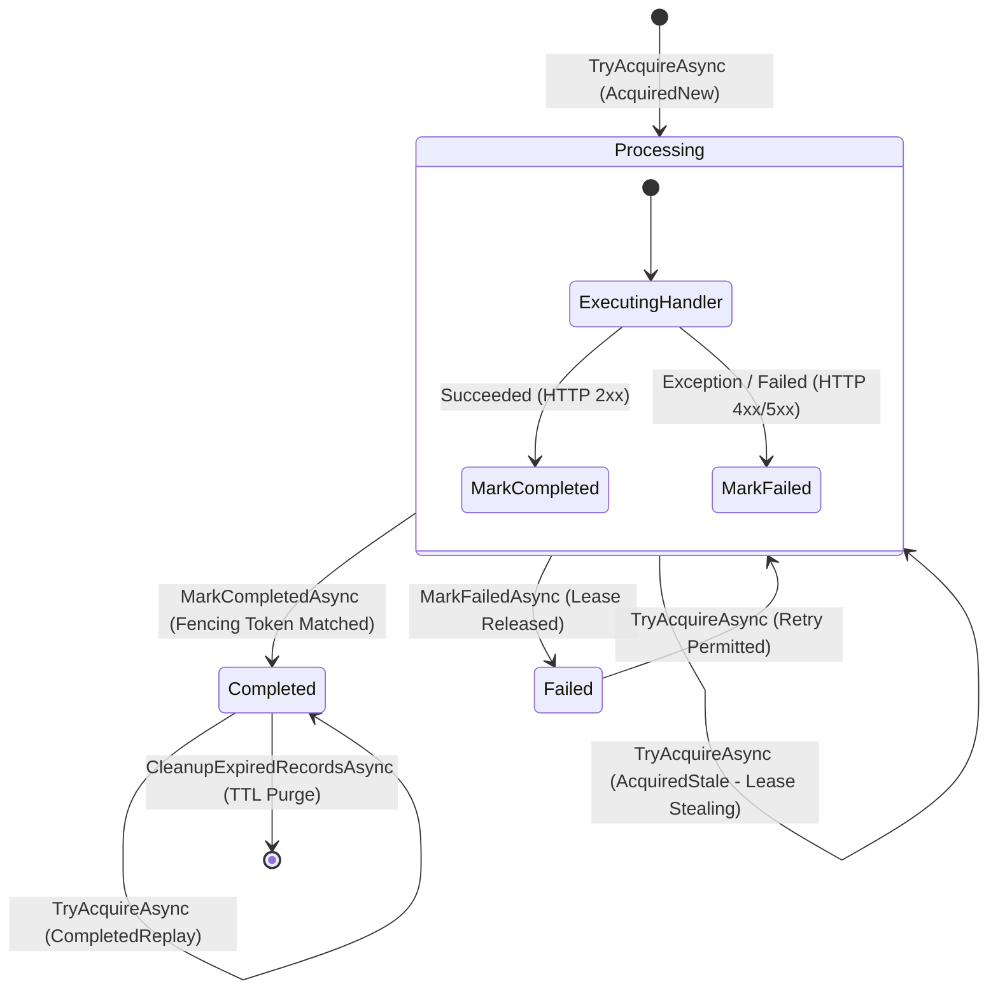

# Level 00: Conceptual Foundations & Architecture

// Copyright © Erickson Lopez. MIT License.  
Author: Erickson López (<ericksonlopezf@gmail.com>)

---

## 1. What is EricksonLopez.Idempotency?

`EricksonLopez.Idempotency` is an enterprise-grade, Native AOT-first architectural framework designed to guarantee **effectively-once execution semantics** across HTTP APIs, background workers, and distributed messaging subscribers in .NET 10.

---

## 2. What Problem Does It Solve?

In distributed systems, networks are inherently unreliable. Retries, client timeouts, load balancer reconnects, and network partitions inevitably cause identical requests to be delivered multiple times. Without architectural idempotency, processing duplicate requests leads to catastrophic business side-effects:

- **Double-charging customers** on payment gateways.
- **Duplicated warehouse dispatches** on e-commerce fulfillment.
- **Corrupted account balances** on banking transactions.
- **Desynchronized third-party integrations**.

```
Client ──[ POST /payments ($100) ]──> [ Network Timeout / Retry ]
Client ──[ POST /payments ($100) ]──> [ Server Receives Twice ] ──> Double Charge!
```

`EricksonLopez.Idempotency` intercepts duplicate operations and **deterministically replays the cached outcome** without re-executing business logic.

---

## 3. Separation of Concerns in Clean Architecture

Idempotency is distinct from other enterprise consistency concerns. The following matrix illustrates the precise boundaries:

| Architectural Concern | Core Question | Guarantee Provided | Representative Library |
|---|---|---|---|
| **Idempotency** | *"Is this the same logical operation?"* | At-most-once execution; deterministic replay. | `EricksonLopez.Idempotency` |
| **Concurrency** | *"Did the underlying state change concurrently?"* | Optimistic lock detection; version conflict detection. | `EricksonLopez.Concurrency` |
| **Transactions** | *"Are these multi-table operations atomic?"* | ACID transactional boundary coordination. | `EricksonLopez.Transactions` |
| **Outbox** | *"How do we publish events safely without dual-writes?"* | Reliable at-least-once message publication. | `EricksonLopez.Outbox` |
| **Resilience** | *"How do we recover from transient network faults?"* | Circuit breaking, retries, and rate limiting. | `EricksonLopez.Resilience` |
| **Result** | *"How is the business outcome represented?"* | Railway-oriented explicit error handling. | `EricksonLopez.Result` |

---

## 4. State Machine Progression

`EricksonLopez.Idempotency` governs the lifecycle of every operation through a strict 3-state state machine:



### State Semantics

1. **Processing (`status = 1`)**:
   - The key is actively claimed by a worker node.
   - An ownership lease (`OwnerToken` GUID) and concurrency version fencing token (`int`) are issued.
   - Concurrent calls for the same key receive `InFlightConflict` (HTTP 409).

2. **Completed (`status = 2`)**:
   - The business handler succeeded.
   - Response status code, headers, and serialized body are stored.
   - Future calls with identical key and matching fingerprint receive `CompletedReplay` with the stored payload.

3. **Failed (`status = 3`)**:
   - The handler threw an exception or returned an uncacheable status code.
   - The lease is cleared, allowing safe immediate client retries.

---

## 5. Next Steps

Proceed to [Level 01: Quick Start & Primitives](level-01-quick-start.md) to set up your first idempotent execution engine in less than 20 lines of code.
