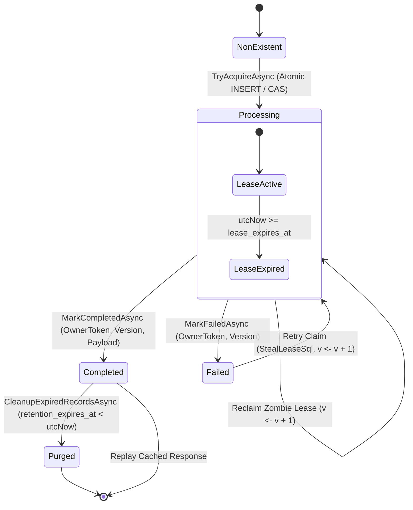

# Formal State Machine and Lifecycle

// Copyright © Erickson Lopez. MIT License.  
Author: Erickson López (<ericksonlopezf@gmail.com>)

---

## 1. Lifecycle State Definitions

Every idempotency record progresses through an immutable, strictly validated state machine modeled by `IdempotencyStatus`:

```csharp
public enum IdempotencyStatus : byte
{
    Processing = 1,
    Completed = 2,
    Failed = 3
}
```



---

## 2. Transition Rules and Invariants

| Transition | Permitted? | Condition & Invariant |
|---|---|---|
| `Non-Existent → Processing` | **YES** | Atomic `INSERT ... ON CONFLICT DO NOTHING` claims ownership token and sets initial concurrency version to `1`. |
| `Processing → Completed` | **YES** | Worker presents matching `OwnerToken` and `ConcurrencyVersion`. Persists status code, headers, and serialized response body. |
| `Processing → Failed` | **YES** | Worker encounters unrecoverable exception or business rejection; marks record failed so subsequent retries may acquire it. |
| `Completed → Processing` | **NO** | **Forbidden**. Completed records are immutable and can only be replayed until expired and purged. |
| `Failed → Processing` | **YES** | Allowed via atomic lease stealing (`StealLeaseSql`), incrementing concurrency version $v \leftarrow v + 1$. |
| `Processing (Expired Lease) → Processing` | **YES** | Zombie worker detection. A new worker reclaims the key if `lease_expires_at_utc < UtcNow`. |

---

## 3. Concurrency Tokens and Fencing

To prevent split-brain execution where a slow or paused worker wakes up and attempts to overwrite a reclaimed record:

1. **OwnerToken (`Guid`)**: Unique identifier per worker lease.
2. **ConcurrencyVersion (`int`)**: Monotonically increasing fencing counter.
3. Every state mutation checks both tokens:
   ```sql
   UPDATE idempotency_records
   SET status = 2, ...
   WHERE tenant_id = @TenantId
     AND scope = @Scope
     AND idempotency_key = @Key
     AND owner_token = @OwnerToken
     AND concurrency_version = @ConcurrencyVersion;
   ```
If zero rows are affected, the worker knows its lease was revoked and discards the write safely.
